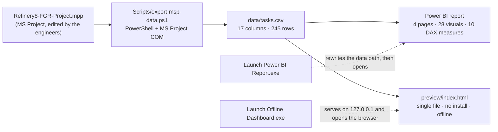

<div dir="rtl">

# 🏗️ داشبورد پیشرفت پروژهٔ EPC پالایشگاه

**از MS Project تا پیشرفت آیتمیک وزنی، و از آنجا تا Power BI و یک داشبورد وب آفلاین بدون نصب**

[](https://github.com/hossein-moradi-sci/refinery-epc-progress-dashboard/actions/workflows/checks.yml)
[](LICENSE)
[](NOTICE.md)

<p align="center">
  <a href="README.md"></a>
  <a href="README.fa.md"></a>
</p>


این داشبورد را برای سرپرست تعمیر و نگهداری یک پالایشگاه ساختم و خودم تا تحویل پایانی جلو
بردم. برنامهٔ پکیج EPC روی MS Project است و هر هفته باید عدد پیشرفت را می‌دادیم — به تیم
سایت، به جلسهٔ هفتگی، به هرکسی که می‌پرسید کجای کاریم. من می‌خواستم یک عدد باشد که همه
به آن اعتماد کنند.

برای همین مسیر از برنامه تا آن عدد را خودکار کردم. اکسپورتر فایل MPP را می‌خواند، در یک
CSV کوچک می‌ریزد، و همان یک فایل دو نمای کاملاً مستقل را جلو می‌اندازد: یک گزارش چهارصفحه‌ای
Power BI برای بستهٔ جلسه، و یک صفحهٔ وب تک‌فایلی که روی سیستمی بدون هیچ نصبی باز می‌شود.

عددی که روی صفحه می‌بینید پیشرفت آیتمیک وزنی است، همان جمع‌بندی‌ای که یک برنامه‌ریز روی
MS Project امضا می‌کند — نه میانگین سادهٔ درصد کارها. اختلافش با جمع‌بندی خودِ MS Project
کمتر از **۰٫۱۵ واحد درصد** است.

## ✨ چیزهایی که دارد

- 📂 **یک منبع واحد** — MS Project یک CSV می‌نویسد و هر دو نمایش از همان می‌خوانند، پس گزارش و صفحه هیچ‌وقت از هم فاصله نمی‌گیرند
- 📊 **گزارش چهارصفحه‌ای دوزبانهٔ Power BI** — ۲۸ نمودار، ۱۰ محاسبهٔ DAX که خودم نوشتم، فارسی و انگلیسی
- 🌐 **داشبورد آفلاین، بدون نصب** — یک فایل HTML؛ نه Power BI لازم دارد، نه Node، نه اینترنت؛ از روی فلش هم باز می‌شود
- 🔽 **دریل‌دان** روی کل صفحه یا داخل هر نمودار، فیلتر فاز و دیسیپلین و وضعیت، و مقایسهٔ دو بازهٔ زمانی
- 📅 **پریویو** برای ۷، ۱۴ و ۳۰ روز آینده، به‌همراه مسیر بحرانی و SPI در یک نگاه
- 🖨️ **برگهٔ چاپ یک‌صفحه‌ای A4** با کلید `P` یا `Ctrl+P`، هفت تم رنگی، فارسی و انگلیسی
- 🔄 **به‌روزرسانی دستی، عمداً** — عددها فقط وقتی جابه‌جا می‌شوند که دکمهٔ *به‌روزرسانی از MS Project* را بزنید

> ⚠️ **دربارهٔ داده‌ها — دادهٔ منتشرشده بی‌نام‌شده است.**
> این مخزن از یک پروژهٔ واقعی در یک پالایشگاه درآمده. نام آیتم‌ها، دیسیپلین‌ها، نقاط عطف،
> عنوان پروژه و تاریخ‌های `data/` را `tools/anonymize-data.mjs` عوض کرده و کل تقویم هم
> جابه‌جا شده. وزن‌ها و درصدها اما واقعی‌اند؛ همین‌هاست که عددهای پایین را واقعی می‌کند نه
> ساختگی. فایل `.mpp`، خروجی خام و فهرست واژه‌های بی‌نام‌سازی **منتشر نشده‌اند**.
> [NOTICE.md](NOTICE.md) دقیقاً نوشته چه چیزهایی عوض شده و چه چیزهایی عمداً مانده است.

## 📊 اعداد کلیدی

| شاخص | مقدار |
|---|---|
| اقلام خروجی | **۲۴۵ ردیف** — ۲۲۶ آیتم برگ + ۱۹ نقطهٔ عطف |
| پیشرفت واقعی وزنی | **۴۲٫۱٪** (`Σ (وزن × Physical % Complete) ÷ Σ وزن`) |
| پیشرفت برنامه‌ای وزنی | **۵۷٫۳٪** |
| انحراف | **−۱۵٫۱ واحد درصد** (عقب‌تر از برنامه) |
| شاخص SPI | **۰٫۷۴** (واقعی ÷ برنامه‌ای — فقط زمان‌بندی؛ خروجی دادهٔ هزینه ندارد) |
| نقاط عطف تکمیل‌شده | **۸ از ۱۹** |
| اقلام بحرانی | **۱۴** |
| تاریخ وضعیت (دادهٔ نمونه) | ۲۰۲۵-۰۶-۳۰ |
| تطابق با جمع‌بندی خود MS Project | کمتر از **۰٫۱۵ واحد درصد**، در همهٔ سطوح |

## 🤔 چرا ساخته شد

پیشرفت یک پکیج EPC هیچ‌وقت میانگین سادهٔ درصد کارها نیست. کابلی که ۰٫۲٪ وزن دارد نباید
به‌اندازهٔ کمپرسوری که ۵٫۸٪ وزن دارد حساب شود. خودِ MS Project وزن × درصد را جمع می‌زند؛
من هم داشبورد را وادار کردم همان را بازتولید کند، نه اینکه دومین حساب را از صفر بسازد.

مشکل اینجاست که MS Project این جمع‌بندی را با ستون‌های فرمول پنهانش حساب می‌کند. کافی
است یک سلول دستی عوض شود تا همهٔ گزارش‌های بعدی بی‌صدا با برنامه‌ای که به کارفرما می‌رود
فرق پیدا کنند. برای همین یک هدف ساده گذاشتم: همان یک عدد در سه جا یکی باشد.

1. در MS Project، همان‌جا که مهندس‌ها `Physical % Complete` را وارد می‌کنند؛
2. در Power BI، برای بستهٔ گزارش و جلسهٔ هفتگی؛
3. روی صفحه‌ای که از روی فلش، روی سیستمی که هیچ‌چیز نصب ندارد باز می‌شود.

## 🖼️ تصاویر

| داشبورد آفلاین (تم روشن) | برگهٔ چاپ جلسه (A4) |
|---|---|
|  |  |

| Power BI — نمای کلی (فارسی) | Power BI — جزئیات اقلام (فارسی) |
|---|---|
|  |  |

| Power BI — نمای کلی (انگلیسی) | Power BI — جزئیات اقلام (انگلیسی) |
|---|---|
|  |  |

کل صفحهٔ داشبورد آفلاین، از بالا تا پایین:


## 🧩 اجزا چطور به هم می‌خورند

<div dir="ltr">



</div>

یک فایل عوض می‌شود، هر دو نمایش عوض می‌شوند. اسم ستون CSV را عوض کنید، باید در همان کامیت
دست به اکسپورتر، جدول‌های TMDL و صفحهٔ وب بزنید — این قید در
[docs/architecture.md](docs/architecture.md) نوشته شده است.

## 🧮 فرمول‌ها

| سنجه | فرمول |
|---|---|
| پیشرفت واقعی وزنی | `Σ (WeightPercent × PhysicalPercentComplete) ÷ Σ WeightPercent` — فقط روی **آیتم‌های برگ** |
| پیشرفت برنامه‌ای وزنی | `Σ (WeightPercent × PlannedPercent) ÷ Σ WeightPercent` — روی آیتم‌های برگ |
| انحراف | `واقعی − برنامه‌ای` |
| SPI | `واقعی ÷ برنامه‌ای` — شاخص زمان‌بندی؛ **عمداً** CPI نیست، چون خروجی دادهٔ هزینه ندارد |

هرچه روی صفحه می‌بینید از همین چهار خط درمی‌آید. مدل Power BI همین‌ها را با DAX و از روی
`ActualWeight` و `PlannedWeight` حساب می‌کند؛ صفحهٔ وب و `tools/verify-progress.mjs` اما از
`WeightPercent` × درصدها. دو مسیر مستقل که با هم چک می‌شوند — ابزار راستی‌آزمایی برای همین
وجود دارد.

## 📁 ساختار مخزن

<div dir="ltr">

```
.
├─ README.md                        this file (English)
├─ README.fa.md                     the same README in Persian
├─ Launch Offline Dashboard.exe     one-click offline page (Windows, no install)
├─ Launch Power BI Report.exe       fixes the data path, syncs, opens the report
├─ Project-File/                    drop folder for the engineers' .mpp  (see its README)
├─ Refinery8-FGR-Dashboard/         the dashboard itself
│   ├─ Refinery8-FGR.pbip           Power BI project (report + semantic model)
│   ├─ Refinery8-FGR.Report/        4 pages, 28 visuals, FA + EN, custom theme
│   ├─ Refinery8-FGR.SemanticModel/ hand-written TMDL: 3 tables, 10 measures
│   ├─ data/                        the synced CSVs (the anonymised sample ships here)
│   ├─ preview/index.html           the offline dashboard — one file, 4,090 lines
│   ├─ preview/server.mjs           the same static server in Node (dev/agent use)
│   ├─ Scripts/                     exporter (PowerShell), launchers (C#), build script
│   └─ README.md                    the original Persian operations manual
├─ tools/                           anonymise · verify · leak-check · validate · check-page
├─ .github/workflows/checks.yml     the gates that run on every push
└─ docs/                            architecture, decisions, portfolio text, screenshots
```

</div>

## 🚀 شروع سریع

**فقط داشبورد آفلاین — بدون هیچ نصبی:**

<div dir="ltr">

```
1. Double-click  Launch Offline Dashboard.exe
2. It serves the page on http://127.0.0.1:8642 and opens your browser.
```

</div>

صفحه فارسی بالا می‌آید و یک کلید EN دارد: هفت تم رنگی، فیلترها، دریل‌دان روی کل صفحه یا
به‌تفکیک هر نمودار، منوی انتخاب نمودار، مقایسهٔ دو بازهٔ زمانی، پنجرهٔ پریویو، جدول اقلام با
رندر مجازی، و برگهٔ جلسهٔ A4 با کلید `P` یا `Ctrl+P`. نه به Power BI نیاز دارد، نه به Node،
نه به اینترنت.

هیچ‌چیزش روی تایمر کار نمی‌کند. عددها فقط وقتی عوض می‌شوند که دکمهٔ
**«به‌روزرسانی از MS Project»** را بزنید — همان دکمه اکسپورتر را بی‌صدا اجرا می‌کند و صفحه
را تازه می‌کند.

**گزارش Power BI**

<div dir="ltr">

```
1. Double-click  Launch Power BI Report.exe
   (it rewrites the model's absolute data path to this folder, syncs if a .mpp is present,
    then opens Refinery8-FGR.pbip)
2. No .mpp yet? The report still opens on the CSV that ships in data/.
```

</div>

**سینک از برنامهٔ واقعی**

<div dir="ltr">

```
1. Put the engineers' .mpp into Project-File\   (newest file wins, the name does not matter)
2. powershell -File Refinery8-FGR-Dashboard\Scripts\export-msp-data.ps1     (needs MS Project)
3. Offline page: press the update button.   Power BI: press Refresh.
```

</div>

این روال عمداً دستی است. در این پروژه خبری از تسک زمان‌بندی‌شده، سرویس یا اسکریپت
پس‌زمینه نیست؛ چون هر تیمی که پنجره‌ای بدون خواستن باز شده را ببیند، دیگر به عددها اعتماد
نمی‌کند. ریتم کار همان جابه‌جایی فایل بین مهندس‌هاست، نه تایمر.

## 🛠️ کجای کار واقعاً سخت بود

خودِ فرمول پیشرفت یک خط حساب و کسور است. این پنج تا بیشتر از همه وقتم را گرفتند.

- **اتصال به MS Project از راه COM قابل اعتماد نیست.** `GetActiveObject` می‌تواند یک
  نمونهٔ مرده برگرداند که مجموعهٔ `Projects` آن خالی است (بعد از kill شدن اجباری)، و
  `CreateInstance` وقتی نمونهٔ قبلی هنوز در حال بسته شدن است `InvalidCastException`
  می‌دهد. برای همین اکسپورتر فعال‌سازی را دوباره تلاش می‌کند، نمونهٔ زنده را ترجیح می‌دهد،
  همان MS Project در حال اجرا را قرض می‌گیرد و در نهایت فایل را از روی دیسک باز می‌کند.
  CSV را هم اول در `.tmp` می‌نویسد و بعد جابه‌جا می‌کند تا Power BI هرگز فایل نیمه‌نوشته
  نخواند.
- **پروژهٔ Power BI دست‌نویس است.** فایل `.pbip` ترکیبی از TMDL و JSON همان PBIR است و
  اشتباه‌ها فقط به شکل پنجره‌ای ظاهر می‌شوند که می‌گوید *«Issues were found»* — پیام واقعی
  در یک WebView رندر می‌شود که نه Win32 می‌تواند بخواندش و نه UI Automation. کامنت `//`
  نامعتبر است (فقط `///`)، `lineageTag` دست‌ساز مدل را می‌شکند، و تمی که یک اسلات رنگی کم
  داشته باشد بی‌صدا نادیده گرفته می‌شود.
- **پرتابل بودن به یک مسیر مطلق گره خورده.** Power Query گزینهٔ مسیر نسبی ندارد، پس
  پارامتر `DataFolder` مدل مطلق است و جابه‌جا کردن پوشه همهٔ جدول‌ها را می‌شکند. لانچر
  Power BI این مقدار را در هر اجرا از نو می‌نویسد؛ همین یک خط است که نسخهٔ روی فلش را
  کار می‌کند.
- **لانچرها به‌اجبار C# 5 هستند.** روی سیستم‌های هدف خبری از SDK و NuGet نیست، پس هر دو
  لانچر با `csc.exe` خودِ فریم‌ورک کامپایل می‌شوند. یکی پوشه را روی loopback سرو می‌کند و
  سه دقیقه بعد از آخرین ضربان صفحه خاموش می‌شود؛ دیگری نصب غیراستاندارد Power BI را پیدا
  می‌کند، مسیر داده را درست می‌کند و دکمهٔ *«Refresh now»* را از طریق UI Automation می‌زند.
- **گزارش باید از چاپ سالم بیرون بیاید.** برگهٔ جلسه بیرون از قاب ساخته می‌شود، اندازه‌گیری
  و ردیف‌به‌ردیف پر می‌شود تا یک صفحهٔ A4 پر شود، و بعد با پالت روشن «کاغذی» چاپ می‌شود —
  حتی وقتی داشبورد تیره است. برای همین همان برگه منحنی S خودش را از نو می‌کشد و منحنی
  تیره را کپی نمی‌کند.

اشتباه‌هایی که به این قیدها رسید، در [docs/technical-decisions.md](docs/technical-decisions.md)
نوشته‌ام.

## ✅ خودت چک کن

هیچ‌کدام از حرف‌های بالا را لازم نیست قبول کنید؛ پشتشان یک فرمان است و خودتان می‌توانید
اجرایشان کنید. سه فرمانی که دادهٔ خصوصی نمی‌خواهند، با هر push اجرا می‌شوند — نشان سبز
بالای همین صفحه همان سه تا هستند.

| چک | فرمان | چه چیزی را ثابت می‌کند | CI |
|---|---|---|---|
| ریاضیات پیشرفت | `node tools/verify-progress.mjs --expect "42.1,57.3,-15.1" --leaves 226 --milestones 19 --critical 14` | CSV همان عددهایی را می‌دهد که داشبورد نشان می‌دهد، و ستون‌های وزنی Power BI با حساب صفحهٔ وب می‌خوانند | ✅ |
| سلامت گزارش و مدل | `node tools/validate-json.mjs` | همهٔ فایل‌های `.json`/`.pbip`/`.platform` پارس می‌شوند، تم سفارشی همان‌طور که Power BI واقعاً اعمال می‌کند وصل است، و مسیرهای پروژه سر جایشان هستند | ✅ |
| سینتکس صفحه | `node tools/check-page.mjs` | صفحه دقیقاً یک بلوک `<script>` دارد و به‌عنوان جاوااسکریپت پارس می‌شود | ✅ |
| بی‌نام‌سازی | `node tools/leak-check.mjs` | هیچ واژه‌ای از پروژهٔ اصلی در هیچ‌جای درخت نمانده — حتی داخل فایل‌های اجرایی | سمت نویسنده |
| لانچرها | `powershell -File Refinery8-FGR-Dashboard\Scripts\build-launchers.ps1 -OutDir .` | سورس‌های `.cs` با `csc.exe` خودِ فریم‌ورک کامپایل می‌شوند، بدون نیاز به SDK | ویندوز |

<div dir="ltr">

```bash
# thirty seconds, from a fresh clone, no install:
node tools/verify-progress.mjs --expect "42.1,57.3,-15.1" --leaves 226 --milestones 19 --critical 14
node tools/validate-json.mjs
node tools/check-page.mjs
```

</div>

اسکن نشت اما واژگان همان پروژهٔ واقعی را با خودش دارد، برای همین تنها فرمانی است که فقط روی
سیستمی اجرا می‌شود که خودِ داده پشتش است. [tools/README.md](tools/README.md) این
تقسیم‌بندی را توضیح داده و [NOTICE.md](NOTICE.md) نوشته بی‌نام‌سازی دقیقاً چه کرد و تنها
چیزی که عمداً پذیرفته شده چیست.

## ⚠️ این پروژه چه چیزی نیست

- **چندکاربره نیست.** تک‌کاربر و تک‌سیستم: بدون سرور، بدون دیتابیس، بدون state مشترک. دو
  نفر که هم‌زمان یک نسخه را ویرایش کنند، به هم می‌خورند — برای همین کار هم جابه‌جایی خودِ
  فایل `.mpp` است.
- **دادهٔ هزینه ندارد.** عمداً خبری از CPI، منحنی هزینهٔ ارزش کسب‌شده و پیش‌بینی تا اتمام
  نیست. اضافه کردنشان اول از همه یعنی بزرگ کردن اکسپورتر.
- **زمان‌واقعی نیست.** به‌روزرسانی عمداً دستی است (بالا گفتم)، پس «عدد کهنه» بخشی از روال
  کار است، نه باگ.
- **ویندوزی است.** لانچرها و اکسپورتر از COM در MS Project و WinForms استفاده می‌کنند؛
  خودِ صفحهٔ وب HTML/JS ساده است و هرجا سرو شود کار می‌کند.
- **جای Power BI را نمی‌گیرد.** صفحهٔ آفلاین همان ریاضیات آیتمیک، منحنی S و فیلترها را
  دارد؛ صفحات رو به کارفرمای گزارش، در Power BI می‌مانند.

## 🧑‍💻 این را چطور ساختم

من مهندس برق قدرت هستم. این پروژه را سرپرست تعمیر و نگهداری یک پالایشگاه به من سپرد — نامش
همان‌طور که باید در این مخزن نیست — و کل کار را خودم تحویل دادم.

در سمت برنامه‌ریزی و کنترل پروژه: روش اندازه‌گیری پیشرفت را تعریف کردم، جمع‌بندی وزنی MS
Project را با خطای کمتر از ۰٫۱۵ واحد درصد بازتولید کردم، و همان دیده‌هایی را ساختم که یک
کنترل‌گر پروژه هر هفته استفاده می‌کند — SPI، منحنی S، پریویو، مسیر بحرانی، مقایسهٔ دو بازه
و برگهٔ یک‌صفحه‌ای جلسه.

در سمت فنی: اکسپورتر PowerShell، مدل دست‌نویس Power BI، صفحهٔ آفلاین، دو لانچر و ابزارهای
راستی‌آزمایی. هر سه مسیر را روی ویندوز امتحان کردم: فلش، Power BI و صفحهٔ آفلاین.

هر عددی که در همین صفحه می‌بینید با یک فرمان از `tools/` از نو حساب می‌شود و دلیل
تصمیم‌ها در `docs/` نوشته شده — برای عدد پیشرفت تنها جواب قابل قبول این است که «خودت
اجرا کن»، برای همین کل مخزن حول همین چیده شده.

**اگر داری این را برای بررسی می‌خوانی:** جاهای خوب برای سؤال این‌هاست: میانگین وزنی، اینکه
چرا منحنی S در دو سرش قید شده، اینکه چرا دونات فیلتر می‌کند ولی دریل نمی‌رود، و اینکه چرا
سینک دستی است.

## 📄 پروانه و داده

کد با پروانهٔ [MIT](LICENSE). دادهٔ نمونه از یک پروژهٔ واقعی آمده و فقط برای نمایش منتشر
شده — پیش از استفادهٔ مجدد [NOTICE.md](NOTICE.md) را ببینید.

**مهندس حسین مرادی** — مهندس تکنولوژی برق قدرت · برنامه‌ریزی و کنترل پروژه

---

🌐 این توضیحات به انگلیسی: **[README.md](README.md)**

</div>
