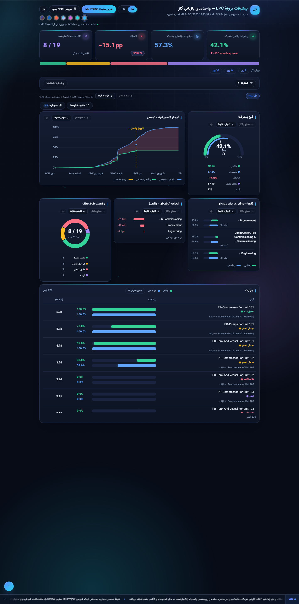
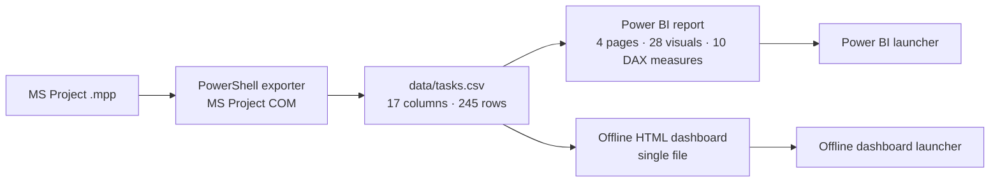

<div dir="rtl">

# 🏗️ داشبورد پیشرفت پروژه EPC پالایشگاه

**MS Project → پیشرفت وزنی آیتم‌ها → Power BI + داشبورد آفلاین بدون نصب**

[](https://github.com/hossein-moradi-sci/refinery-epc-progress-dashboard/actions/workflows/checks.yml)
[](LICENSE)
[](NOTICE.md)

<p align="center" dir="ltr">
  <a href="README.md"><strong>ENGLISH</strong></a>
  &nbsp;•&nbsp;
  <a href="README.fa.md"><strong>فارسی</strong></a>
</p>


## معرفی

این پروژه یک سامانهٔ یکپارچه برای **کنترل و گزارش پیشرفت پروژه EPC** است که بر پایهٔ برنامهٔ زمان‌بندی MS Project ساخته شده است.

فایل برنامه ابتدا به یک CSV تبدیل می‌شود و همان فایل داده، مبنای دو بخش اصلی سیستم است:

- یک گزارش چهارصفحه‌ای Power BI برای گزارش‌دهی و کنترل پروژه؛
- یک داشبورد HTML تک‌فایلی که هنگام اجرا به Power BI، Node.js یا اینترنت نیاز ندارد.

محاسبهٔ اصلی پروژه **پیشرفت وزنی آیتم‌ها** است. به‌جای میانگین‌گیری ساده از درصد پیشرفت فعالیت‌ها، وزن هر آیتم در نتیجه لحاظ می‌شود. نتیجهٔ دادهٔ نمونه با جمع‌بندی وزنی MS Project با اختلاف کمتر از **۰٫۱۵ واحد درصد** مطابقت دارد.

## ✨ قابلیت‌های اصلی

- 📂 **یک منبع دادهٔ مشترک** — هر دو رابط از همان CSV استفاده می‌کنند.
- 📊 **گزارش Power BI** — ۴ صفحه، ۲۸ ویژوال و ۱۰ Measure با DAX، با رابط فارسی و انگلیسی.
- 🌐 **داشبورد آفلاین** — یک فایل HTML، بدون نیاز به نصب در زمان اجرا.
- 🔽 **فیلتر و Drill-down** — بر اساس فاز، دیسیپلین و وضعیت، همراه با مقایسهٔ دو بازهٔ زمانی.
- 📅 **Look-ahead** — بازه‌های ۷، ۱۴ و ۳۰ روزه، به‌همراه اطلاعات مسیر بحرانی و SPI.
- 🖨️ **برگهٔ جلسه A4** — خلاصهٔ یک‌صفحه‌ای آمادهٔ چاپ.
- 🔄 **به‌روزرسانی دستی** — داده فقط با درخواست کاربر از MS Project تغییر می‌کند.
- 🌍 **رابط دوزبانه** — فارسی و انگلیسی در گزارش و داشبورد آفلاین.

> **دربارهٔ داده‌ها:** دادهٔ منتشرشده بی‌نام‌سازی شده است. این مخزن از یک فرایند واقعی کنترل پیشرفت در یک پروژه EPC پالایشگاهی تهیه شده، اما اطلاعات شناسایی‌کنندهٔ پروژه حذف یا تغییر داده شده‌اند. نام‌ها و تاریخ‌ها بی‌نام‌سازی شده‌اند و وزن‌ها و درصدهای پیشرفت حفظ شده‌اند تا محاسبات منتشرشده قابل بررسی باقی بمانند. فایل اصلی .mpp، خروجی خام و واژگان بی‌نام‌سازی منتشر نشده‌اند. جزئیات در [NOTICE.md](NOTICE.md) آمده است.

## 📊 اعداد دادهٔ نمونه

| شاخص | مقدار |
|---|---:|
| ردیف‌های برنامه | **۲۴۵** — ۲۲۶ آیتم برگ + ۱۹ نقطهٔ عطف |
| پیشرفت واقعی وزنی | **۴۲٫۱٪** |
| پیشرفت برنامه‌ای وزنی | **۵۷٫۳٪** |
| انحراف | **−۱۵٫۱ واحد درصد** |
| شاخص عملکرد زمان‌بندی (SPI) | **۰٫۷۴** |
| نقاط عطف تکمیل‌شده | **۸ از ۱۹** |
| آیتم‌های بحرانی | **۱۴** |
| تاریخ وضعیت دادهٔ نمونه | **۲۰۲۵-۰۶-۳۰** |
| تطابق با جمع‌بندی MS Project | **کمتر از ۰٫۱۵ واحد درصد** |

در این پروژه SPI فقط یک شاخص **زمان‌بندی** است و به‌صورت actual / planned محاسبه می‌شود. دادهٔ منتشرشده اطلاعات هزینه ندارد؛ بنابراین پروژه ادعایی دربارهٔ CPI یا شاخص‌های هزینه‌ای ارزش کسب‌شده ندارد.

## چرا پیشرفت وزنی؟

در یک برنامهٔ EPC، همهٔ فعالیت‌ها اهمیت یکسانی ندارند. میانگین ساده می‌تواند باعث شود یک فعالیت کم‌وزن بیش از اندازه روی نتیجهٔ نهایی اثر بگذارد.

**پیشرفت وزنی = Σ (وزن × درصد پیشرفت) ÷ Σ وزن**

در این محاسبه فقط آیتم‌های برگ وارد می‌شوند و نقاط عطف جداگانه بررسی می‌شوند.

این منطق به‌صورت مستقل در مدل Power BI، داشبورد آفلاین و ابزارهای راستی‌آزمایی پیاده‌سازی شده است.

## 🖼️ تصاویر

| داشبورد آفلاین — تم روشن | برگهٔ جلسه A4 |
|---|---|
|  |  |

| Power BI — نمای کلی | Power BI — جزئیات آیتم‌ها |
|---|---|
|  |  |

| Power BI — نمای کلی انگلیسی | Power BI — جزئیات انگلیسی |
|---|---|
|  |  |

تصویر کامل داشبورد:



## 🧩 معماری

<div dir="ltr">



</div>

قاعدهٔ اصلی معماری ساده است: **یک CSV مشترک و دو لایهٔ نمایش**.

اگر ساختار CSV تغییر کند، اکسپورتر، مدل Power BI و صفحهٔ وب باید هماهنگ با هم تغییر کنند. این قرارداد در [docs/architecture.md](docs/architecture.md) مستند شده است.

## 🧮 مدل محاسبات

| شاخص | فرمول |
|---|---|
| پیشرفت واقعی وزنی | Σ (WeightPercent × PhysicalPercentComplete) / Σ WeightPercent |
| پیشرفت برنامه‌ای وزنی | Σ (WeightPercent × PlannedPercent) / Σ WeightPercent |
| انحراف | actual − planned |
| SPI | actual / planned |

نقاط عطف از محاسبهٔ پیشرفت وزنی آیتم‌های برگ جدا هستند.

ابزار راستی‌آزمایی، CSV منتشرشده را مستقل از Power BI و داشبورد وب دوباره محاسبه می‌کند و اعداد اصلی را بررسی می‌کند.

## 🚀 شروع سریع

### داشبورد آفلاین

1. روی **Launch Offline Dashboard.exe** دوبار کلیک کنید.
2. برنامه یک سرور محلی روی 127.0.0.1:8642 اجرا می‌کند و داشبورد را در مرورگر پیش‌فرض باز می‌کند.

داشبورد شامل رابط فارسی و انگلیسی، ۷ تم ظاهری، فیلتر و Drill-down، مقایسهٔ دو بازهٔ زمانی، Look-ahead برای ۷، ۱۴ و ۳۰ روز، جدول آیتم‌ها، برگهٔ جلسهٔ A4 و دکمهٔ **به‌روزرسانی از MS Project** است.

در زمان اجرا به Power BI، Node.js یا اینترنت نیاز ندارد.

### گزارش Power BI

1. روی **Launch Power BI Report.exe** دوبار کلیک کنید.
2. لانچر مسیر داده را با محل فعلی پوشه هماهنگ می‌کند.
3. اگر فایل .mpp موجود باشد، امکان همگام‌سازی CSV وجود دارد.
4. گزارش Power BI را باز یا Refresh کنید.

همگام‌سازی عمداً دستی است و در پروژه هیچ Task زمان‌بندی‌شده، سرویس پس‌زمینه یا به‌روزرسانی خودکار ۱۵ دقیقه‌ای وجود ندارد.

## 🛠️ تصمیم‌های فنی مهم

### اتصال به MS Project با COM

اکسپورتِر برای مشکلات عملی MS Project COM، از جمله نمونه‌های قدیمی، تأخیر در راه‌اندازی و تفاوت سطح دسترسی، مسیرهای بازیابی دارد. در صورت امکان از نمونهٔ فعال استفاده می‌کند و در شرایط لازم فایل را از روی دیسک باز می‌کند.

خروجی CSV ابتدا در یک فایل موقت نوشته و سپس جایگزین فایل قبلی می‌شود تا فایل ناقص در اختیار Power BI قرار نگیرد.

### ساختار پروژهٔ Power BI

پروژه به‌صورت PBIP/PBIR/TMDL نگهداری شده است. این ساختار باعث می‌شود مدل و گزارش در Git قابل بررسی باشند و ابزارهای اعتبارسنجی مخزن نیز ساختار فایل‌ها را کنترل کنند.

### اجرای قابل حمل

Power Query از یک پارامتر مسیر مطلق برای پوشهٔ داده استفاده می‌کند. **Launch Power BI Report.exe** قبل از اجرای گزارش این مسیر را با محل فعلی پروژه هماهنگ می‌کند؛ بنابراین پروژه را می‌توان بدون وابستگی به مسیر ثابت یک سیستم جابه‌جا کرد.

### داشبورد آفلاین

صفحهٔ HTML از همان CSV مورد استفادهٔ Power BI استفاده می‌کند و ابزارهای راستی‌آزمایی نیز یک مسیر محاسباتی مستقل برای اعداد اصلی فراهم می‌کنند.

### چاپ

برگهٔ A4 جدا از چیدمان اصلی صفحه تولید می‌شود تا خروجی چاپی خوانا بماند و به تم انتخاب‌شده وابسته نباشد.

جزئیات بیشتر در [docs/technical-decisions.md](docs/technical-decisions.md) آمده است.

## ✅ راستی‌آزمایی

مخزن برای محاسبات پیشرفت، فایل‌های پروژه و مدل، سینتکس صفحه و بی‌نام‌سازی ابزارهای بررسی دارد.

<div dir="ltr">

```bash
node tools/verify-progress.mjs --expect "42.1,57.3,-15.1" --leaves 226 --milestones 19 --critical 14
node tools/validate-json.mjs
node tools/check-page.mjs
```

</div>

فرمان اول اعداد اصلی را مستقیماً از CSV منتشرشده دوباره محاسبه می‌کند.

## ⚠️ محدوده و محدودیت‌ها

- **تک‌کاربره:** سرور اشتراکی، دیتابیس یا وضعیت مشترک چندکاربره ندارد.
- **بدون دادهٔ هزینه:** CPI، منحنی‌های هزینه و برآورد هزینه تا پایان پروژه در مدل فعلی وجود ندارند.
- **بلادرنگ نیست:** همگام‌سازی دستی است.
- **مبتنی بر ویندوز:** اکسپورتر و لانچرها به Windows و MS Project وابسته‌اند؛ خود صفحهٔ HTML/JavaScript وابستگی خاصی به ویندوز ندارد.
- **جایگزین Power BI نیست:** داشبورد آفلاین یک نمای سبک‌تر برای استفادهٔ عملیاتی است و مدل کامل گزارش‌دهی در Power BI باقی می‌ماند.

## 🧑‍💻 نقش من در پروژه

این سیستم را برای یک فرایند واقعی برنامه‌ریزی و کنترل پیشرفت پروژهٔ پالایشگاهی از ابتدا تا انتها توسعه دادم.

کار من هم بخش کنترل پروژه و هم بخش فنی را پوشش می‌داد:

- تعریف منطق محاسبهٔ پیشرفت وزنی؛
- بازتولید جمع‌بندی وزنی MS Project با اختلاف کمتر از ۰٫۱۵ واحد درصد؛
- توسعهٔ مسیر خروجی‌گیری MS Project با PowerShell؛
- ساخت مدل، گزارش و Measureهای DAX در Power BI؛
- توسعهٔ داشبورد HTML آفلاین؛
- ساخت لانچرهای ویندوزی؛
- اضافه‌کردن ابزارهای اعتبارسنجی و بررسی سازگاری؛
- آماده‌سازی دادهٔ بی‌نام‌سازی‌شده و مستندات پروژه.

این پروژه در نقطهٔ اتصال **مهندسی برق قدرت، برنامه‌ریزی و کنترل پروژه، تحلیل داده، Power BI و توسعهٔ نرم‌افزار** قرار می‌گیرد.

## 📄 مجوز و داده

کد پروژه تحت مجوز [MIT](LICENSE) منتشر شده است.

دادهٔ منتشرشده از یک پروژهٔ واقعی استخراج شده، اما بی‌نام‌سازی شده و صرفاً برای نمایش قابلیت‌های سیستم منتشر شده است. پیش از استفادهٔ مجدد [NOTICE.md](NOTICE.md) را مطالعه کنید.

**مهندس حسین مرادی** — مهندس برق قدرت · برنامه‌ریزی و کنترل پروژه

---

🌐 نسخهٔ انگلیسی: **[README.md](README.md)**

</div>