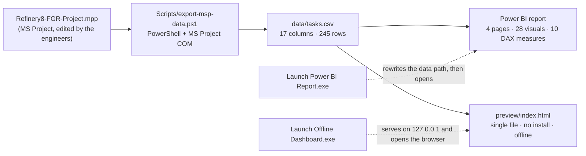

<div dir="rtl">

# 🏗️ داشبورد پیشرفت پروژهٔ EPC — پالایشگاه

**از MS Project تا پیشرفت آیتمیک وزنی، و از آنجا تا Power BI و یک داشبورد وب آفلاین بدون نصب**

[](https://github.com/hossein-moradi-sci/refinery-epc-progress-dashboard/actions/workflows/checks.yml)
[](LICENSE)
[](NOTICE.md)

<p align="center">
  <a href="README.md"></a>
  <a href="README.fa.md"></a>
</p>


من برای پروژه‌های عمرانی ابزار کنترل پیشرفت می‌سازم. این ابزار برنامه را مستقیم از MS Project
می‌خواند، آن را به یک CSV کوچک تبدیل می‌کند و از همان یک فایل **دو نمایش کاملاً مستقل** می‌سازد:
یک گزارش چهارصفحه‌ای Power BI، و یک داشبورد وب تک‌فایلی که روی سیستمی که هیچ‌چیز نصب ندارد باز
می‌شود.

عددی که نشان می‌دهد همان پیشرفت **آیتمیک وزنی** است که برنامه‌ریز پروژه تحویل می‌گیرد — نه
میانگین درصد کارها — و با جمع‌بندی خود MS Project تا کمتر از **۰٫۱۵ واحد درصد** جور درمی‌آید.

> ⚠️ **دربارهٔ داده‌ها — دیتاست منتشرشده بی‌نام است.**
> این مخزن از یک پروژهٔ عمرانی واقعی بیرون آمده. نام همهٔ آیتم‌ها، دیسیپلین‌ها، نقاط عطف، عنوان
> پروژه و تاریخ‌ها در پوشهٔ `data/` با ابزار `tools/anonymize-data.mjs` جانشین شده‌اند و کل تقویم
> جابه‌جا شده است. وزن‌ها و درصدها اما، اعداد واقعی خودِ پروژه‌اند؛ همان چیزی که باعث می‌شود
> عددهای پایین واقعی باشند و نه ساختگی. فایل `.mpp`، خروجی واقعی و واژگانی که برای بی‌نام‌سازی
> استفاده شده **منتشر نشده‌اند**. جزئیات دقیق در [NOTICE.md](NOTICE.md).

## 📊 اعداد کلیدی

| | |
|---|---|
| اقلام خروجی | **۲۴۵ ردیف** — ۲۲۶ آیتم برگ + ۱۹ نقطهٔ عطف |
| پیشرفت واقعی وزنی | **۴۲٬۱٪** = `Σ (وزن × Physical % Complete) ÷ Σ وزن` |
| پیشرفت برنامه‌ای وزنی | **۵۷٬۳٪** |
| انحراف | **−۱۵٬۱ واحد درصد** (عقب‌تر از برنامه) |
| شاخص SPI | **۰٫۷۴** (واقعی ÷ برنامه‌ای — فقط زمان‌بندی؛ خروجی دادهٔ هزینه ندارد) |
| نقاط عطف تکمیل‌شده | **۸ از ۱۹** |
| اقلام بحرانی | **۱۴** |
| تاریخ وضعیت (دادهٔ نمونه) | ۲۰۲۵-۰۶-۳۰ |
| تطابق با جمع‌بندی خود MS Project | کمتر از **۰٬۱۵ واحد درصد**، در همهٔ سطوح |

## 🤔 چرا ساخته شد

پیشرفت یک پکیج عمرانی هیچ‌وقت میانگین سادهٔ درصد کارها نیست؛ **میانگین وزنی** است. یک کابل
ابزار دقیق با وزن ۰٬۲٪ نباید هم‌قدر یک کمپرسور با وزن ۶٪ حساب شود — و در MS Project هم نمی‌شود.

مشکل اینجاست که MS Project این حساب را با ستون‌های فرمول داخلی خودش انجام می‌دهد. یک سلول که
دستی عوض شود، و تمام گزارش‌های بعدی بی‌سروصدا با برنامه‌ای که تحویل کارفرما می‌شود اختلاف پیدا
می‌کنند. هدف این پروژه دقیقاً همین بود؛ کاری کسل‌کننده و مهم: اینکه **همان یک عدد** در سه جا
دیده شود:

- در MS Project، همان‌جا که مهندس‌ها `Physical % Complete` را وارد می‌کنند؛
- در Power BI، برای پک گزارش و جلسهٔ هفتگی؛
- روی صفحه‌ای که از روی فلش، روی سیستمی که هیچ‌چیز نصب ندارد باز می‌شود.

## 🖼️ تصاویر

| داشبورد آفلاین (تم روشن) | برگهٔ چاپ جلسه (A4) |
|---|---|
|  |  |

| Power BI — نمای کلی (فارسی) | Power BI — جزئیات اقلام (فارسی) |
|---|---|
|  |  |

تصویر کامل صفحه: [`docs/img/dashboard-full.png`](docs/img/dashboard-full.png) ·
صفحات انگلیسی گزارش: [`pbi-page3`](docs/img/pbi-page3-dashboard-en.png) / [`pbi-page4`](docs/img/pbi-page4-details-en.png)

## 🧩 اجزا چطور به هم می‌خورند



یک فایل عوض می‌شود → هر دو نمایش عوض می‌شوند. اسم یک ستون CSV را که عوض کنید، باید در همان
کامیت دست به اکسپورتر، جدول‌های TMDL و صفحهٔ وب هم ببرید؛ همین قید در
[docs/architecture.md](docs/architecture.md) نوشته شده است.

## 🧮 فرمول‌ها

| سنجه | فرمول |
|---|---|
| پیشرفت واقعی وزنی | `Σ (WeightPercent × PhysicalPercentComplete) ÷ Σ WeightPercent` — فقط روی **آیتم‌های برگ** |
| پیشرفت برنامه‌ای وزنی | `Σ (WeightPercent × PlannedPercent) ÷ Σ WeightPercent` — روی آیتم‌های برگ |
| انحراف | `واقعی − برنامه‌ای` |
| SPI | `واقعی ÷ برنامه‌ای` — شاخص زمان‌بندی؛ **عمداً** CPI نیست، چون خروجی دادهٔ هزینه ندارد |

مدل Power BI این کار را در DAX و از روی `ActualWeight` و `PlannedWeight` انجام می‌دهد؛ صفحهٔ وب و
`tools/verify-progress.mjs` همان را از `WeightPercent` × درصدها بازحساب می‌کنند. هر دو مسیر با هم
مقایسه می‌شوند — دلیل وجود همان ابزار راستی‌آزمایی همین است.

## 📁 ساختار مخزن

<div dir="ltr">

```
.
├─ README.md                        this file (English)
├─ README.fa.md                     the same README in Persian
├─ Launch Offline Dashboard.exe     one-click offline page (Windows, no install)
├─ Launch Power BI Report.exe       fixes the data path, syncs, opens the report
├─ Project-File/                    drop folder for the engineers' .mpp  (see its README)
├─ Refinery8-FGR-Dashboard/         the dashboard itself
│   ├─ Refinery8-FGR.pbip           Power BI project (report + semantic model)
│   ├─ Refinery8-FGR.Report/        4 pages, 28 visuals, FA + EN, custom theme
│   ├─ Refinery8-FGR.SemanticModel/ hand-written TMDL: 3 tables, 10 measures
│   ├─ data/                        the synced CSVs (the anonymised sample ships here)
│   ├─ preview/index.html           the offline dashboard — one file, 4,090 lines
│   ├─ preview/server.mjs           the same static server in Node (dev/agent use)
│   ├─ Scripts/                     exporter (PowerShell), launchers (C#), build script
│   └─ README.md                    the original Persian operations manual
├─ tools/                           anonymise · verify · leak-check · validate · check-page
├─ .github/workflows/checks.yml     the gates that run on every push
└─ docs/                            architecture, decisions, portfolio text, screenshots
```

</div>

## 🚀 شروع سریع

**بدون نصب — فقط داشبورد آفلاین:** روی `Launch Offline Dashboard.exe` دوبار کلیک کنید. صفحه را
روی `http://127.0.0.1:8642` سرو می‌کند و مرورگرتان را باز می‌کند.

صفحه با زبان فارسی و یک کلید EN بالا می‌آید: هفت تم رنگی، فیلترها، کاوش (در سطح کل صفحه و
به‌تفکیک هر نمودار)، انتخابگر نمودار، مقایسهٔ دو بازهٔ زمانی، پیش‌نگر (Look-ahead)، جدول
مجازی‌سازی‌شدهٔ اقلام، و برگهٔ جلسهٔ A4 با کلید `P` یا `Ctrl+P`. نه Power BI لازم دارد، نه Node،
نه اینترنت.

هیچ‌چیز در آن روی تایمر اجرا نمی‌شود و این عمدی است: عددها فقط وقتی عوض می‌شوند که دکمهٔ
**«به‌روزرسانی از MS Project»** را بزنید — همان دکمه اکسپورتر را بی‌صدا اجرا می‌کند و صفحه را
نو می‌کند.

**گزارش Power BI:** `Launch Power BI Report.exe` را اجرا کنید. مسیر مطلق دادهٔ مدل را با پوشهٔ
فعلی هماهنگ می‌کند، اگر فایل `.mpp` موجود باشد سینک می‌کند و بعد `Refinery8-FGR.pbip` را باز
می‌کند. اگر هنوز `.mpp` نگذاشته باشید، گزارش با همان CSV موجود در `data/` باز می‌شود.

**سینک از برنامهٔ واقعی:** فایل `.mpp` را در `Project-File\` بگذارید (جدیدترین فایل خوانده
می‌شود، اسم مهم نیست)، بعد `Scripts/export-msp-data.ps1` را اجرا کنید (نیازمند MS Project) و در
صفحه دکمهٔ به‌روزرسانی، یا در Power BI دکمهٔ Refresh را بزنید.

این روال **عمداً دستی** است. هیچ تسک ویندوزی، سرویس یا ناظری در این پروژه وجود ندارد، چون تیمی
که پنجره‌ای را خودبه‌خود بالا بیاید ببیند، دیگر به عددها اعتماد نمی‌کند. ریتم کار، جابه‌جایی فایل
بین مهندس‌هاست، نه تایمر.

## 🛠️ کجای کار واقعاً سخت بود

ریاضیات دامنه‌ای‌اش یک میانگین وزنی است؛ سختی، همه‌جای دیگری بود.

- **رابط COM در MS Project اخلاق خوشی ندارد.** `GetActiveObject` می‌تواند یک نمونهٔ مرده برگرداند که
  مجموعهٔ `Projects` آن خالی است (بعد از kill شدن اجباری)، و `CreateInstance` وقتی نمونهٔ قبلی
  هنوز در حال deregister شدن است، `InvalidCastException` می‌دهد. برای همین اکسپورتر فعال‌سازی را
  دوباره تلاش می‌کند، نمونهٔ *زنده* را ترجیح می‌دهد، همان MS Project در حال اجرا را قرض می‌گیرد و
  نه اینکه دومی بسازد، و در نهایت فایل را بی‌سر‌و‌صدا از روی دیسک باز می‌کند — و CSV را اتمیک
  می‌نویسد (`.tmp` → move) که Power BI هرگز فایل نیمه‌نوشته نخواند.
- **پروژهٔ Power BI دست‌نویس است.** فایل `.pbip` ترکیبی است از TMDL و JSON همان PBIR، و مدل شکست
  یک اشتباه، پنجره‌ای است که فقط می‌گوید *«Issues were found»* — پیام واقعی در یک WebView رندر
  می‌شود که نه Win32 می‌تواند بخواندش و نه UI Automation. کامنت `//` نامعتبر است (فقط `///`)،
  `lineageTag` دست‌ساز مدل را می‌شکند، و تمی که یک اسلات رنگی کم داشته باشد، بی‌صدا نادیده گرفته
  می‌شود و خطایی نمی‌دهد.
- **پرتابل بودن به یک مسیر مطلق گره خورده.** Power Query گزینهٔ مسیر نسبی ندارد، پس پارامتر
  `DataFolder` مدل مطلق است و جابه‌جا کردن پوشه همهٔ جدول‌ها را می‌شکند. اجراکنندهٔ Power BI این
  مقدار را در هر اجرا از نو می‌نویسد؛ همین یک خط باعث می‌شود نسخهٔ روی فلش کار کند.
- **اجراکننده‌ها به‌اجبار C# 5 هستند.** با `csc.exe` خودِ .NET Framework کامپایل می‌شوند (بدون SDK
  و NuGet): یکی پوشه را روی loopback سرو می‌کند و سه دقیقه بعد از آخرین ضربان‌آهنگ صفحه خودش را
  خاموش می‌کند، دیگری نصب غیراستاندارد Power BI را پیدا می‌کند، مسیر داده را درست می‌کند و از طریق
  UI Automation دکمهٔ *«Refresh now»* را می‌زند.
- **گزارش باید از چاپ سالم بیرون بیاید.** برگهٔ جلسه بیرون از قاب ساخته می‌شود، اندازه‌گیری و
  ردیف‌به‌ردیف پر می‌شود تا یک صفحهٔ A4 پر شود، و بعد با پالت روشن «کاغذی» چاپ می‌شود — حتی وقتی
  داشبورد تیره است. برای همین همان برگه منحنی S خودش را از نو می‌کشد و منحنی تیره را کپی نمی‌کند.

اشتباه‌هایی که این قیدها را ساختند، در [docs/technical-decisions.md](docs/technical-decisions.md)
نوشته شده‌اند.

## ✅ خودت چک کن

هیچ‌جای این پروژه نمی‌خواهد که پذیرفته شود؛ هر ادعای بالا یک فرمان پشتش است، و آن سه فرمانی که
دادهٔ خصوصی نمی‌خواهند در هر push اجرا می‌شوند — همان بج بالای همین صفحه.

| دروازه | فرمان | چه چیزی را ثابت می‌کند | CI |
|---|---|---|---|
| ریاضیات پیشرفت | `node tools/verify-progress.mjs --expect "42.1,57.3,-15.1" --leaves 226 --milestones 19 --critical 14` | CSV همان عددهایی را می‌دهد که داشبورد ادعا می‌کند، و ستون‌های وزنی Power BI با حساب صفحهٔ وب می‌خوانند | ✅ |
| سلامت گزارش و مدل | `node tools/validate-json.mjs` | همهٔ فایل‌های `.json`/`.pbip`/`.platform` پارس می‌شوند، تم سفارشی همان‌طور که Power BI واقعاً اعمال می‌کند سیم‌کشی شده، و مسیرهای پروژه سر جایشان هستند | ✅ |
| سینتکس صفحه | `node tools/check-page.mjs` | صفحه دقیقاً یک بلوک `<script>` دارد و به‌عنوان جاوااسکریپت پارس می‌شود | ✅ |
| بی‌نام‌سازی | `node tools/leak-check.mjs` | هیچ واژه‌ای از پروژهٔ اصلی در هیچ‌جای درخت نمانده — حتی داخل فایل‌های اجرایی | سمت نویسنده |
| اجراکننده‌ها | `powershell -File Refinery8-FGR-Dashboard\Scripts\build-launchers.ps1 -OutDir .` | سورس‌های `.cs` با `csc.exe` خودِ فریم‌ورک کامپایل می‌شوند، بدون نیاز به SDK | ویندوز |

<div dir="ltr">

```bash
# thirty seconds, from a fresh clone, no install:
node tools/verify-progress.mjs --expect "42.1,57.3,-15.1" --leaves 226 --milestones 19 --critical 14
node tools/validate-json.mjs
node tools/check-page.mjs
```

</div>

اسکن نشت، طبعاً واژگان همان پروژه‌ای را با خود دارد که از آن محافظت می‌کند؛ پس تنها دروازه‌ای است
که روی همان سیستمی می‌ماند که داده را دارد. [tools/README.md](tools/README.md) این تقسیم را توضیح
می‌دهد و [NOTICE.md](NOTICE.md) نوشته که بی‌نام‌سازی دقیقاً چه کرد و تنها بازماندهٔ پذیرفته‌شده چیست.

## ⚠️ این پروژه چه چیزی نیست

- **چندکاربره نیست.** تک‌کاربر و تک‌سیستم: بدون سرور، بدون دیتابیس، بدون state مشترک. دو نفر که
  هم‌زمان یک نسخه از *داشبورد* را ویرایش کنند، به هم می‌خورند — کاری که تحویل فایل `.mpp` انجام
  می‌دهد.
- **دادهٔ هزینه ندارد**، پس عمداً CPI، منحنی هزینهٔ ارزش کسب‌شده و پیش‌بینی تا اتمام وجود ندارد.
  اضافه کردنشان اول از همه یعنی بزرگ کردن اکسپورتر.
- **زمان‌واقعی نیست.** به‌روزرسانی عمداً دستی است (بالاتر توضیح دادم)، پس «عدد کهنه شده» یک ویژگی
  روال کار است، نه باگ.
- **ویندوزی است.** اجراکننده‌ها و اکسپورتر از COM در MS Project و WinForms استفاده می‌کنند؛ خودِ
  *صفحهٔ وب* HTML/JS ساده است و هرجا سرو شود کار می‌کند.
- **جای Power BI را نمی‌گیرد.** صفحهٔ آفلاین همان ریاضیات آیتمیک، منحنی S و فیلترها را دارد؛
  صفحات رو به کارفرمای گزارش، در Power BI می‌مانند.

## 🧑‍💻 این را چطور ساختم

من مهندس برق قدرت هستم، نه مهندس نرم‌افزار. این ابزار را خودم مشخص کردم، منطق کاری‌اش هم مال خودم
است — میانگین وزنی، پنجرهٔ پیش‌نگر (Look-ahead)، و اینکه SPI چه معنایی دارد و چه معنایی ندارد.
همهٔ عددها را با خود MS Project چک کردم و هر سه مسیر را روی ویندوز تست کردم: فلش، Power BI و
صفحهٔ آفلاین. کدش را در جلسه‌های **AI-assisted** و زیر نظر خودم نوشتم. همین هم دلیل صادقانهٔ این
است که چرا این مخزن این‌قدر سند و توضیح دارد و یک پوشهٔ `tools/` هم کنارش است: راستی‌آزمایی باید
چیزی می‌بود که خودم بتوانم اجرا کنم و بخوانم.

**اگر داری این را برای بررسی می‌خوانی:** جاهای جذاب برای سؤال پرسیدن این‌هاست — میانگین وزنی،
اینکه چرا منحنی S در دو سرش قید شده، اینکه چرا دونات فیلتر می‌کند و کاوش نمی‌رود، و اینکه چرا
سینک دستی است.

## 📄 پروانه و داده

کد با پروانهٔ [MIT](LICENSE). دادهٔ نمونه از یک پروژهٔ واقعی مشتق شده و فقط برای نمایش منتشر شده
است — پیش از استفادهٔ مجدد [NOTICE.md](NOTICE.md) را ببینید.

**مهندس حسین مرادی** — مهندس تکنولوژی برق قدرت، کنترل پروژه‌های عمرانی.

---

🌐 این توضیحات به انگلیسی: **[README.md](README.md)**

</div>
