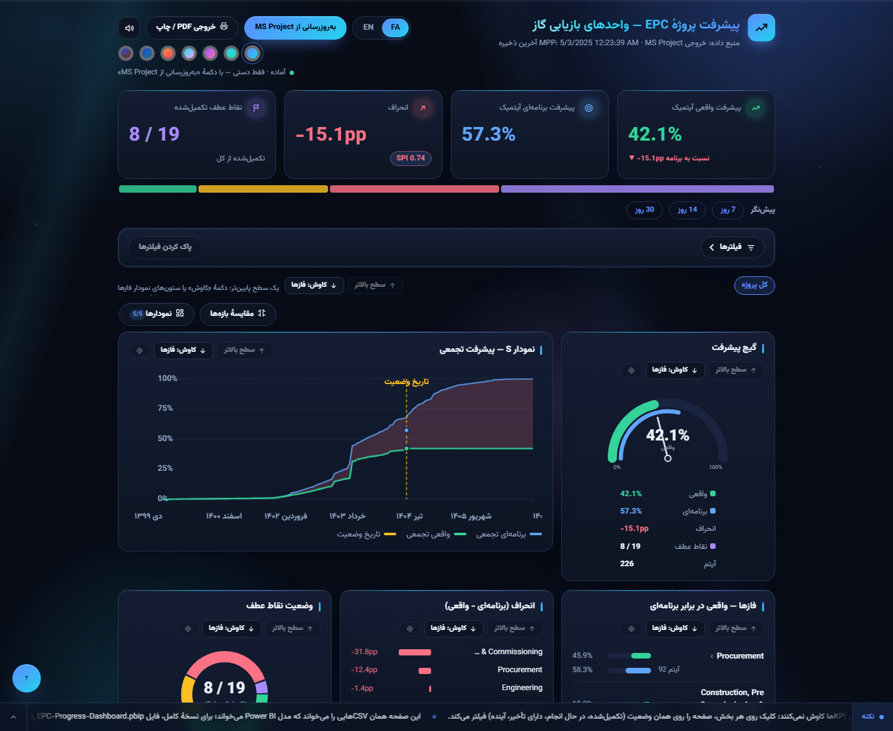
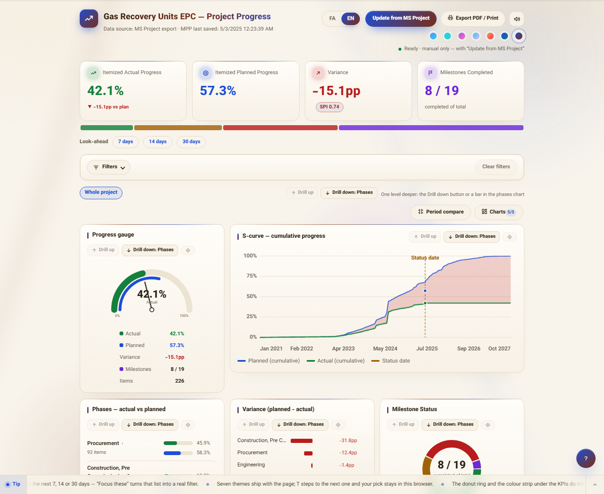
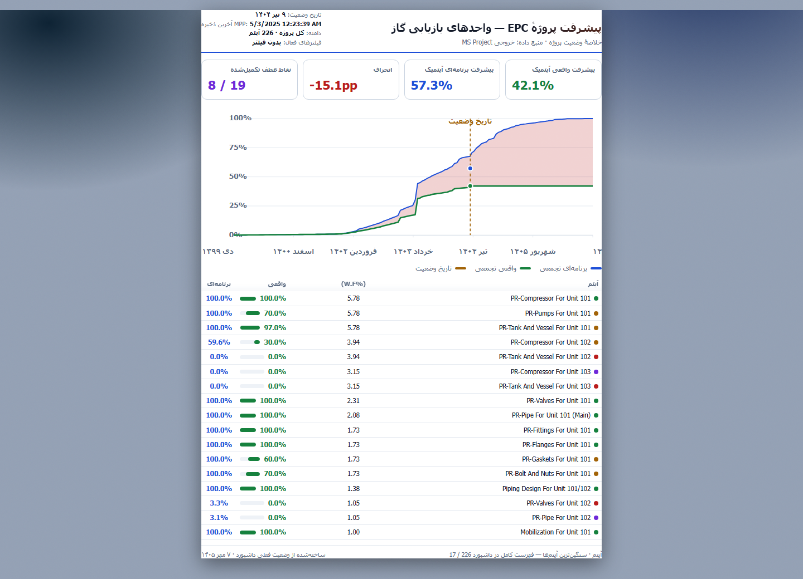
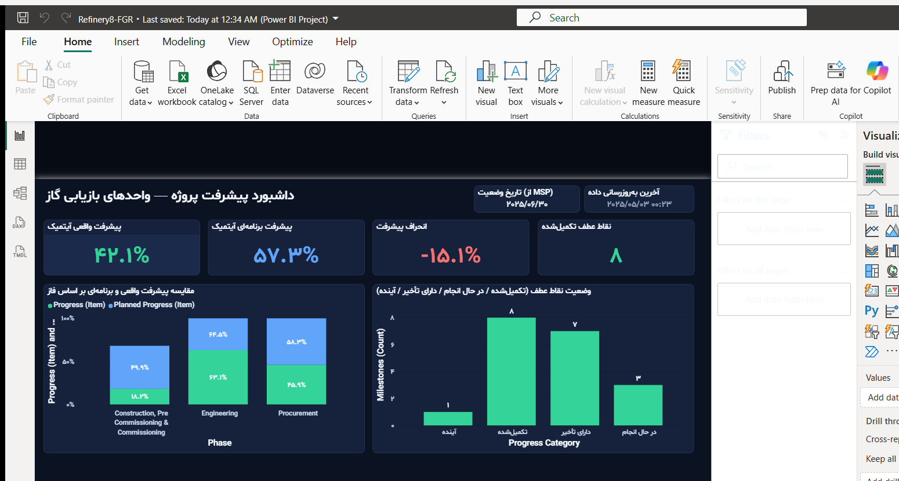
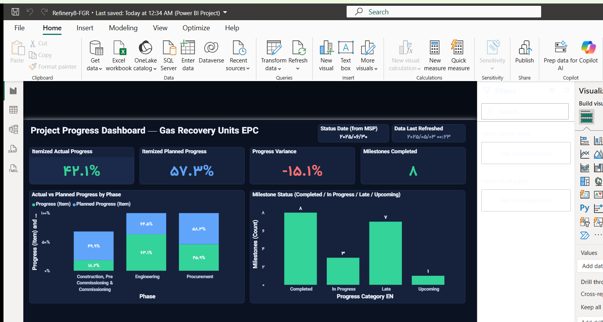
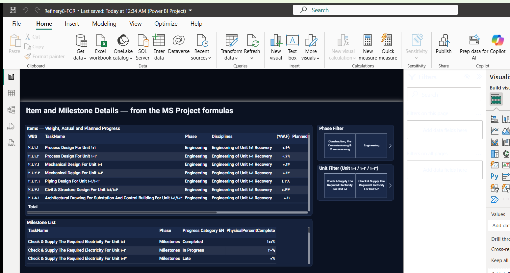
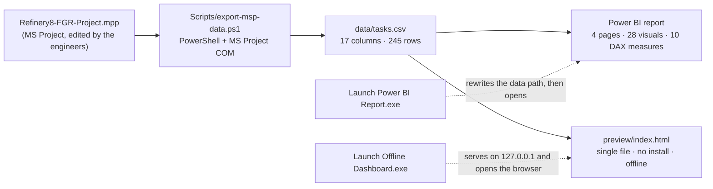

<div dir="rtl">

# 🏗️ داشبورد پیشرفت پروژهٔ EPC پالایشگاه

**از MS Project تا پیشرفت آیتمیک وزنی، و از آنجا تا Power BI و یک داشبورد وب آفلاین بدون نصب**

[](https://github.com/hossein-moradi-sci/refinery-epc-progress-dashboard/actions/workflows/checks.yml)
[](LICENSE)
[](NOTICE.md)

<p align="center">
  <a href="README.md"></a>
  <a href="README.fa.md"></a>
</p>



کنترل پیشرفت یک **پکیج EPC در پالایشگاه** — سفارش سرپرست تعمیر و نگهداری و تحویلِ تمام و کمال با من. برنامه مستقیم از MS Project خوانده می‌شود، تبدیل می‌شود به یک CSV کوچک، و از همان یک فایل دو نمایش کاملاً مستقل درمی‌آید: یک گزارش چهارصفحه‌ای Power BI، و یک صفحهٔ وب تک‌فایلی که روی سیستمی که هیچ‌چیز نصب ندارد باز می‌شود.

عددی که روی صفحه می‌بینید همان پیشرفت **آیتمیک وزنی** است که برنامه‌ریز پروژه امضا می‌کند، نه میانگین درصد کارها — و با جمع‌بندی خودِ MS Project کمتر از **۰٫۱۵ واحد درصد** فرق دارد.

## ✨ چیزهایی که دارد

- 📂 **یک منبع واحد** — MS Project → یک CSV → هر دو نمایش، پس هیچ‌وقت با هم فرق نمی‌کنند
- 📊 **گزارش چهارصفحه‌ای دوزبانهٔ Power BI** — ۲۸ نمودار، ۱۰ محاسبهٔ DAX دست‌نویس، فارسی و انگلیسی
- 🌐 **داشبورد آفلاین بدون نصب** — یک فایل HTML؛ نه Power BI لازم دارد، نه Node، نه اینترنت؛ از روی فلش هم باز می‌شود
- 🔽 **دریل‌دان** روی کل صفحه یا داخل هر نمودار، فیلترها، مقایسهٔ دو بازهٔ زمانی
- 📅 **پریویوی** ۷ / ۱۴ / ۳۰ روز آینده، مسیر بحرانی و SPI در یک نگاه
- 🖨️ **برگهٔ چاپ یک‌صفحه‌ای A4** با کلید `P` یا `Ctrl+P`، هفت تم رنگی، فارسی و انگلیسی
- 🔄 **به‌روزرسانی دستی، عمداً** — عددها فقط وقتی جابه‌جا می‌شوند که دکمهٔ «به‌روزرسانی از MS Project» را بزنید

> ⚠️ **دربارهٔ داده‌ها — دادهٔ منتشرشده بی‌نام‌شده است.**
> این مخزن از یک پروژهٔ واقعی در یک پالایشگاه درآمده. نام آیتم‌ها، دیسیپلین‌ها، نقاط عطف، عنوان پروژه و تاریخ‌ها در پوشهٔ `data/` با ابزار `tools/anonymize-data.mjs` عوض شده و کل تقویم هم جابه‌جا شده. وزن‌ها و درصدها اما واقعی‌اند؛ همین‌هاست که عددهای پایین را واقعی می‌کند نه ساختگی. فایل `.mpp`، خروجی واقعی و واژگانی که برای بی‌نام‌سازی به کار رفته منتشر نشده‌اند. جزئیات در [NOTICE.md](NOTICE.md).

## 📊 اعداد کلیدی

| | |
|---|---|
| اقلام خروجی | **۲۴۵ ردیف** — ۲۲۶ آیتم برگ + ۱۹ نقطهٔ عطف |
| پیشرفت واقعی وزنی | **۴۲٫۱٪** = `Σ (وزن × Physical % Complete) ÷ Σ وزن` |
| پیشرفت برنامه‌ای وزنی | **۵۷٫۳٪** |
| انحراف | **−۱۵٫۱ واحد درصد** (عقب‌تر از برنامه) |
| شاخص SPI | **۰٫۷۴** (واقعی ÷ برنامه‌ای — فقط زمان‌بندی؛ خروجی دادهٔ هزینه ندارد) |
| نقاط عطف تکمیل‌شده | **۸ از ۱۹** |
| اقلام بحرانی | **۱۴** |
| تاریخ وضعیت (دادهٔ نمونه) | ۲۰۲۵-۰۶-۳۰ |
| تطابق با جمع‌بندی خود MS Project | کمتر از **۰٫۱۵ واحد درصد**، در همهٔ سطوح |

## 🤔 چرا ساخته شد

پیشرفت یک پکیج EPC در پالایشگاه هیچ‌وقت میانگین سادهٔ درصد کارها نیست؛ میانگین وزنی است. کابل با وزن ۰٫۲٪ نباید به‌اندازهٔ کمپرسور با وزن ۵٫۸٪ حساب شود، و در MS Project هم همین‌طور حساب می‌شود.

مشکل این بود که MS Project این حساب را با ستون‌های فرمول داخلی خودش می‌کند. کافی است یک سلول دستی عوض شود تا همهٔ گزارش‌های بعدی بی‌صدا با برنامه‌ای که به کارفرما تحویل می‌شود فرق پیدا کنند. برای همین قرار شد همین یک عدد در سه جا یکی باشد:

1. در MS Project، همان‌جا که مهندس‌ها `Physical % Complete` را وارد می‌کنند؛
2. در Power BI، برای بستهٔ گزارش و جلسهٔ هفتگی؛
3. روی صفحه‌ای که از روی فلش، روی سیستمی که هیچ‌چیز نصب ندارد باز می‌شود.

## 🖼️ تصاویر

| داشبورد آفلاین (تم روشن) | برگهٔ چاپ جلسه (A4) |
|---|---|
|  |  |

| Power BI — نمای کلی (فارسی) | Power BI — جزئیات اقلام (فارسی) |
|---|---|
|  |  |

| Power BI — نمای کلی (انگلیسی) | Power BI — جزئیات اقلام (انگلیسی) |
|---|---|
|  |  |

تصویر کامل صفحه: [`docs/img/dashboard-full.png`](docs/img/dashboard-full.png)

## 🧩 اجزا چطور به هم می‌خورند



یک فایل عوض می‌شود → هر دو نمایش عوض می‌شوند. اسم ستون CSV را عوض کنید، باید در همان کامیت دست به اکسپورتر، جدول‌های TMDL و صفحهٔ وب هم بزنید؛ این قید در [docs/architecture.md](docs/architecture.md) نوشته شده.

## 🧮 فرمول‌ها

| سنجه | فرمول |
|---|---|
| پیشرفت واقعی وزنی | `Σ (WeightPercent × PhysicalPercentComplete) ÷ Σ WeightPercent` — فقط روی **آیتم‌های برگ** |
| پیشرفت برنامه‌ای وزنی | `Σ (WeightPercent × PlannedPercent) ÷ Σ WeightPercent` — روی آیتم‌های برگ |
| انحراف | `واقعی − برنامه‌ای` |
| SPI | `واقعی ÷ برنامه‌ای` — شاخص زمان‌بندی؛ **عمداً** CPI نیست، چون خروجی دادهٔ هزینه ندارد |

مدل Power BI همین کار را در DAX و از روی `ActualWeight` و `PlannedWeight` می‌کند؛ صفحهٔ وب و `tools/verify-progress.mjs` اما از `WeightPercent` × درصدها حساب می‌کنند. این دو مسیر باید با هم جور دربیایند؛ ابزار راستی‌آزمایی هم دقیقاً برای همین ساختم.

## 📁 ساختار مخزن

<div dir="ltr">

```
.
├─ README.md                        this file (English)
├─ README.fa.md                     the same README in Persian
├─ Launch Offline Dashboard.exe     one-click offline page (Windows, no install)
├─ Launch Power BI Report.exe       fixes the data path, syncs, opens the report
├─ Project-File/                    drop folder for the engineers' .mpp  (see its README)
├─ Refinery8-FGR-Dashboard/         the dashboard itself
│   ├─ Refinery8-FGR.pbip           Power BI project (report + semantic model)
│   ├─ Refinery8-FGR.Report/        4 pages, 28 visuals, FA + EN, custom theme
│   ├─ Refinery8-FGR.SemanticModel/ hand-written TMDL: 3 tables, 10 measures
│   ├─ data/                        the synced CSVs (the anonymised sample ships here)
│   ├─ preview/index.html           the offline dashboard — one file, 4,090 lines
│   ├─ preview/server.mjs           the same static server in Node (dev/agent use)
│   ├─ Scripts/                     exporter (PowerShell), launchers (C#), build script
│   └─ README.md                    the original Persian operations manual
├─ tools/                           anonymise · verify · leak-check · validate · check-page
├─ .github/workflows/checks.yml     the gates that run on every push
└─ docs/                            architecture, decisions, portfolio text, screenshots
```

</div>

## 🚀 شروع سریع

**بدون نصب — فقط داشبورد آفلاین:** روی `Launch Offline Dashboard.exe` دوبار کلیک کنید. صفحه روی `http://127.0.0.1:8642` سرو می‌شود و مرورگر را باز می‌کند.

صفحه فارسی بالا می‌آید و یک کلید EN دارد: هفت تم رنگی، فیلترها، دریل‌دان روی کل صفحه و به‌تفکیک هر نمودار، منوی انتخاب نمودار، مقایسهٔ دو بازهٔ زمانی، پریویوی کارهایی که تا ۷، ۱۴ یا ۳۰ روز آینده سررسیدشان می‌رسد، جدول اقلام با رندر مجازی، و برگهٔ جلسهٔ A4 با کلید `P` یا `Ctrl+P`. برای اجرایش نه به Power BI نیاز دارد، نه به Node، نه به اینترنت.

هیچ‌چیزش روی تایمر کار نمی‌کند و این عمدی است: عددها فقط وقتی عوض می‌شوند که دکمهٔ **«به‌روزرسانی از MS Project»** را بزنید — همان دکمه اکسپورتر را بی‌صدا اجرا می‌کند و صفحه را تازه می‌کند.

**گزارش Power BI:** `Launch Power BI Report.exe` را اجرا کنید. مسیر مطلق دادهٔ مدل را با پوشهٔ فعلی هماهنگ می‌کند، اگر فایل `.mpp` باشد سینک می‌کند و بعد `Refinery8-FGR.pbip` را باز می‌کند. اگر هنوز `.mpp` نگذاشته‌اید، گزارش با همان CSV داخل `data/` باز می‌شود.

**سینک از برنامهٔ واقعی:** فایل `.mpp` را در `Project-File\` بگذارید (جدیدترین فایل خوانده می‌شود، اسم مهم نیست)، بعد `Scripts/export-msp-data.ps1` را اجرا کنید (به MS Project نیاز دارد) و در صفحه دکمهٔ به‌روزرسانی، یا در Power BI دکمهٔ Refresh را بزنید.

این روال عمداً دستی است. در این پروژه خبری از تسک ویندوز و سرویس نیست؛ چون هر تیمی که پنجره‌ای بدون خواستن باز شده را ببیند، دیگر به عددها اعتماد نمی‌کند. ریتم کار جابه‌جایی فایل بین مهندس‌هاست، نه تایمر.

## 🛠️ کجای کار واقعاً سخت بود

ریاضیاتش یک میانگین وزنی بود؛ بقیه‌اش سخت بود.

- **رابط COM در MS Project اخلاق خوشی ندارد.** `GetActiveObject` می‌تواند یک نمونهٔ مرده برگرداند که
  مجموعهٔ `Projects` آن خالی است (بعد از kill شدن اجباری)، و `CreateInstance` وقتی نمونهٔ قبلی
  هنوز در حال deregister شدن است، `InvalidCastException` می‌دهد. برای همین اکسپورتر فعال‌سازی را
  دوباره تلاش می‌کند، نمونهٔ *زنده* را ترجیح می‌دهد، همان MS Project در حال اجرا را قرض می‌گیرد و
  نه اینکه دومی بسازد، و در نهایت فایل را بی‌سر‌و‌صدا از روی دیسک باز می‌کند — و CSV را اتمیک
  می‌نویسد (`.tmp` → move) که Power BI هرگز فایل نیمه‌نوشته نخواند.
- **پروژهٔ Power BI دست‌نویس است.** فایل `.pbip` ترکیبی است از TMDL و JSON همان PBIR، و مدل شکست
  یک اشتباه، پنجره‌ای است که فقط می‌گوید *«Issues were found»* — پیام واقعی در یک WebView رندر
  می‌شود که نه Win32 می‌تواند بخواندش و نه UI Automation. کامنت `//` نامعتبر است (فقط `///`)،
  `lineageTag` دست‌ساز مدل را می‌شکند، و تمی که یک اسلات رنگی کم داشته باشد، بی‌صدا نادیده گرفته
  می‌شود و خطایی نمی‌دهد.
- **پرتابل بودن به یک مسیر مطلق گره خورده.** Power Query گزینهٔ مسیر نسبی ندارد، پس پارامتر
  `DataFolder` مدل مطلق است و جابه‌جا کردن پوشه همهٔ جدول‌ها را می‌شکند. لانچر Power BI این
  مقدار را در هر اجرا از نو می‌نویسد؛ همین یک خط باعث می‌شود نسخهٔ روی فلش کار کند.
- **لانچرها به‌اجبار C# 5 هستند.** با `csc.exe` خودِ .NET Framework کامپایل می‌شوند (بدون SDK
  و NuGet): یکی پوشه را روی loopback سرو می‌کند و سه دقیقه بعد از آخرین ضربان‌آهنگ صفحه خودش را
  خاموش می‌کند، دیگری نصب غیراستاندارد Power BI را پیدا می‌کند، مسیر داده را درست می‌کند و از طریق
  UI Automation دکمهٔ *«Refresh now»* را می‌زند.
- **گزارش باید از چاپ سالم بیرون بیاید.** برگهٔ جلسه بیرون از قاب ساخته می‌شود، اندازه‌گیری و
  ردیف‌به‌ردیف پر می‌شود تا یک صفحهٔ A4 پر شود، و بعد با پالت روشن «کاغذی» چاپ می‌شود — حتی وقتی
  داشبورد تیره است. برای همین همان برگه منحنی S خودش را از نو می‌کشد و منحنی تیره را کپی نمی‌کند.

اشتباه‌هایی که به این قیدها رسیدم، در [docs/technical-decisions.md](docs/technical-decisions.md) نوشته‌ام.

## ✅ خودت چک کن

هیچ‌کدام از حرف‌های بالا را لازم نیست قبول کنید؛ پشتشان فرمان است و خودتان می‌توانید اجرایشان کنید. سه فرمانی که دادهٔ خصوصی نمی‌خواهند، با هر push خودکار اجرا می‌شوند — نشان سبز بالای همین صفحه هم همان سه تا را نشان می‌دهد.

| چک | فرمان | چه چیزی را ثابت می‌کند | CI |
|---|---|---|---|
| ریاضیات پیشرفت | `node tools/verify-progress.mjs --expect "42.1,57.3,-15.1" --leaves 226 --milestones 19 --critical 14` | CSV همان عددهایی را می‌دهد که داشبورد ادعا می‌کند، و ستون‌های وزنی Power BI با حساب صفحهٔ وب می‌خوانند | ✅ |
| سلامت گزارش و مدل | `node tools/validate-json.mjs` | همهٔ فایل‌های `.json`/`.pbip`/`.platform` پارس می‌شوند، تم سفارشی همان‌طور که Power BI واقعاً اعمال می‌کند سیم‌کشی شده، و مسیرهای پروژه سر جایشان هستند | ✅ |
| سینتکس صفحه | `node tools/check-page.mjs` | صفحه دقیقاً یک بلوک `<script>` دارد و به‌عنوان جاوااسکریپت پارس می‌شود | ✅ |
| بی‌نام‌سازی | `node tools/leak-check.mjs` | هیچ واژه‌ای از پروژهٔ اصلی در هیچ‌جای درخت نمانده — حتی داخل فایل‌های اجرایی | سمت نویسنده |
| لانچرها | `powershell -File Refinery8-FGR-Dashboard\Scripts\build-launchers.ps1 -OutDir .` | سورس‌های `.cs` با `csc.exe` خودِ فریم‌ورک کامپایل می‌شوند، بدون نیاز به SDK | ویندوز |

<div dir="ltr">

```bash
# thirty seconds, from a fresh clone, no install:
node tools/verify-progress.mjs --expect "42.1,57.3,-15.1" --leaves 226 --milestones 19 --critical 14
node tools/validate-json.mjs
node tools/check-page.mjs
```

</div>

اسکن نشت اما واژگان همان پروژهٔ واقعی را با خودش دارد، برای همین تنها فرمانی است که فقط روی سیستمی اجرا می‌شود که خودِ داده پشتش است. [tools/README.md](tools/README.md) این تقسیم‌بندی را توضیح داده و [NOTICE.md](NOTICE.md) نوشته بی‌نام‌سازی دقیقاً چه کرد و تنها چیزی که عمداً پذیرفته شده چیست.

## ⚠️ این پروژه چه چیزی نیست

- **چندکاربره نیست.** تک‌کاربر و تک‌سیستم: بدون سرور، بدون دیتابیس، بدون state مشترک. دو نفر که
  هم‌زمان یک نسخه از داشبورد را ویرایش کنند، به هم می‌خورند — برای همین کار هم جابه‌جایی خودِ
  فایل `.mpp` است.
- **دادهٔ هزینه ندارد**، پس عمداً خبری از CPI، منحنی هزینهٔ ارزش کسب‌شده و پیش‌بینی تا اتمام نیست.
  اضافه کردنشان اول از همه یعنی بزرگ کردن اکسپورتر.
- **زمان‌واقعی نیست.** به‌روزرسانی عمداً دستی است (بالا گفتم)، پس «عدد کهنه» بخشی از روال کار است،
  نه باگ.
- **ویندوزی است.** لانچرها و اکسپورتر از COM در MS Project و WinForms استفاده می‌کنند؛ خودِ
  صفحهٔ وب HTML/JS ساده است و هرجا سرو شود کار می‌کند.
- **جای Power BI را نمی‌گیرد.** صفحهٔ آفلاین همان ریاضیات آیتمیک، منحنی S و فیلترها را دارد؛
  صفحات رو به کارفرمای گزارش، در Power BI می‌مانند.

## 🧑‍💻 این را چطور ساختم

من مهندس برق قدرت هستم، نه مهندس نرم‌افزار. این پروژه را سرپرست تعمیر و نگهداری یکی از پالایشگاه‌ها به من سپرد و من تحویلش دادم: خودم تعریفش کردم، منطق کاری‌اش مال من است — میانگین وزنی، پریویو، و اینکه SPI چه معنایی دارد و چه معنایی ندارد — همهٔ عددها را با خود MS Project چک کردم و هر سه مسیر را روی ویندوز امتحان کردم: فلش، Power BI و صفحهٔ آفلاین.

هر عددی که در همین صفحه می‌بینید با یک فرمان از `tools/` از نو حساب می‌شود و دلیل تصمیم‌ها در `docs/` نوشته شده — برای عدد پیشرفت، تنها جواب قابل قبول این است که «خودت اجرا کن».

**اگر داری این را برای بررسی می‌خوانی:** جاهای خوب برای سؤال این‌هاست: میانگین وزنی، اینکه چرا منحنی S در دو سرش قید شده، اینکه چرا دونات فیلتر می‌کند ولی دریل نمی‌رود، و اینکه چرا سینک دستی است.

## 📄 پروانه و داده

کد با پروانهٔ [MIT](LICENSE). دادهٔ نمونه از یک پروژهٔ واقعی مشتق شده و فقط برای نمایش منتشر شده — پیش از استفادهٔ مجدد [NOTICE.md](NOTICE.md) را ببینید.

**مهندس حسین مرادی** — مهندس تکنولوژی برق قدرت · برنامه‌ریزی و کنترل پروژه

---

🌐 این توضیحات به انگلیسی: **[README.md](README.md)**

</div>
