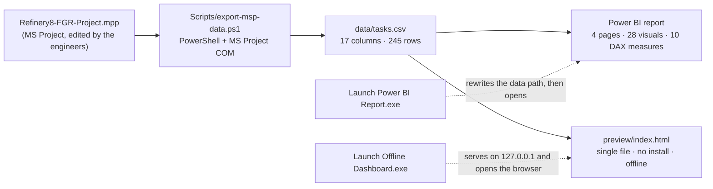

# 🏗️ Refinery EPC Progress Dashboard

**MS Project → weighted itemised progress → Power BI + a zero-install offline dashboard**

[](https://github.com/hossein-moradi-sci/refinery-epc-progress-dashboard/actions/workflows/checks.yml)
[](LICENSE)
[](NOTICE.md)

<p align="center">
  <a href="README.md"></a>
  <a href="README.fa.md"></a>
</p>


I built this dashboard for the maintenance supervisor of a refinery, and I delivered it end to
end. The schedule of the EPC package lives in MS Project, and progress has to be reported every
week — to the site team, to the weekly meeting, to anyone who asks where we are. I wanted one
number that everybody could trust.

So I automated the path from the schedule to that number. The exporter reads the MPP, projects
it into one small CSV, and that single file drives two completely independent views: a
four-page Power BI report for the meeting pack, and a one-file web dashboard that opens on a
machine with nothing installed.

The figure on screen is weighted itemised progress, the same roll-up a planner signs off in
MS Project — not an average of task percentages. It lands within **0.15 pp** of MS Project's
own summary.

## ✨ What you get

- 📂 **One source of truth** — MS Project writes one CSV and both views read it, so the report and the page can never drift apart
- 📊 **Four-page bilingual Power BI report** — 28 visuals, 10 DAX measures written by hand, Persian and English
- 🌐 **Offline dashboard with nothing to install** — a single HTML file; no Power BI, no Node, no internet; it runs from a USB stick
- 🔽 **Drill-down** over the whole page or inside one chart, filters for phase, discipline and status, and a two-period comparison
- 📅 **Look-ahead** for the next 7, 14 or 30 days, plus the critical path and SPI in one glance
- 🖨️ **One-page A4 meeting sheet** on `P` / `Ctrl+P`, seven colour themes, Persian and English
- 🔄 **Manual refresh, on purpose** — the numbers only move when you press *Update from MS Project*

> ⚠️ **About the data — the shipped dataset is anonymised.**
> This repository comes from a real project at a refinery. Every task name, discipline,
> milestone, project title and date in `data/` was replaced by `tools/anonymize-data.mjs`, and
> the whole calendar was shifted. The weights and the percentages are the project's own — that
> is what makes the numbers below real instead of invented. The `.mpp`, the raw export and the
> word list used for the anonymisation are **not** published.
> [NOTICE.md](NOTICE.md) says exactly what changed and what deliberately stayed.

## 📊 The numbers

| Metric | Value |
|---|---|
| Schedule items exported | **245 rows** — 226 leaf items + 19 milestones |
| Weighted actual progress | **42.1 %** (`Σ weight × Physical % Complete / Σ weight`) |
| Weighted planned progress | **57.3 %** |
| Variance | **−15.1 pp** (behind plan) |
| Schedule Performance Index | **0.74** (`actual / planned` — schedule only, the export carries no cost data) |
| Milestones complete | **8 / 19** |
| Critical items | **14** |
| Status date (sample data) | 2025-06-30 |
| Agreement with MS Project's own roll-up | within **0.15 pp**, at every task level |

## 🤔 Why it exists

Progress on an EPC package is never a plain average of task percentages. A cable worth 0.2 %
of the weight must not count as much as a compressor worth 5.8 %. MS Project already rolls up
weight × %, so I made the dashboard reproduce that roll-up instead of inventing a second one.

The problem is that MS Project calculates its roll-up in hidden formula columns. One
hand-edited cell, and every report downstream quietly disagrees with the schedule that goes to
the client. So I set one simple goal: the same number in three places.

1. in MS Project, where the engineers enter `Physical % Complete`;
2. in Power BI, for the report pack and the weekly meeting;
3. on a page that opens from a USB stick on a machine with nothing installed.

## 🖼️ Screenshots

| Offline dashboard (light theme) | The A4 meeting sheet it prints |
|---|---|
|  |  |

| Power BI — overview (FA) | Power BI — item details (FA) |
|---|---|
|  |  |

| Power BI — overview (EN) | Power BI — item details (EN) |
|---|---|
|  |  |

The full offline dashboard, captured top to bottom:


## 🧩 How the pieces fit



One file changes, both views change. Renaming a CSV column means touching the exporter, the
TMDL tables and the page in the same commit — that rule is written down in
[docs/architecture.md](docs/architecture.md).

## 🧮 The maths

| Measure | Formula |
|---|---|
| Weighted actual | `Σ (WeightPercent × PhysicalPercentComplete) / Σ WeightPercent` over **leaf items only** |
| Weighted planned | `Σ (WeightPercent × PlannedPercent) / Σ WeightPercent` over leaf items |
| Variance | `actual − planned` |
| SPI | `actual / planned` — schedule index; deliberately **not** CPI, because the export has no cost data |

Everything on screen comes from these four lines. The Power BI model computes them in DAX from
`ActualWeight` / `PlannedWeight`; the page and `tools/verify-progress.mjs` compute them from
`WeightPercent` × the percentages. Two independent paths that are checked against each other —
that is what the verifier is for.

## 📁 What's where

```
.
├─ README.md                        this file (English)
├─ README.fa.md                     the same README in Persian
├─ Launch Offline Dashboard.exe     one-click offline page (Windows, no install)
├─ Launch Power BI Report.exe       fixes the data path, syncs, opens the report
├─ Project-File/                    drop folder for the engineers' .mpp  (see its README)
├─ Refinery8-FGR-Dashboard/         the dashboard itself
│   ├─ Refinery8-FGR.pbip           Power BI project (report + semantic model)
│   ├─ Refinery8-FGR.Report/        4 pages, 28 visuals, FA + EN, custom theme
│   ├─ Refinery8-FGR.SemanticModel/ hand-written TMDL: 3 tables, 10 measures
│   ├─ data/                        the synced CSVs (the anonymised sample ships here)
│   ├─ preview/index.html           the offline dashboard — one file, 4,090 lines
│   ├─ preview/server.mjs           the same static server in Node (dev/agent use)
│   ├─ Scripts/                     exporter (PowerShell), launchers (C#), build script
│   └─ README.md                    the original Persian operations manual
├─ tools/                           anonymise · verify · leak-check · validate · check-page
├─ .github/workflows/checks.yml     the gates that run on every push
└─ docs/                            architecture, decisions, portfolio text, screenshots
```

## 🚀 Quick start

**Just the offline dashboard — nothing installed**

```
1. Double-click  Launch Offline Dashboard.exe
2. It serves the page on http://127.0.0.1:8642 and opens your browser.
```

The page comes up in Persian with an EN switch: seven colour themes, filters, drill-down (the
whole page or one chart at a time), a chart picker, period comparison, the look-ahead window,
a virtualised item table, and the A4 meeting sheet on `P` / `Ctrl+P`. It needs **no** Power
BI, **no** Node and **no** internet.

Nothing runs on a timer. The numbers only move when you press
**«به‌روزرسانی از MS Project»** — that button runs the exporter hidden and reloads the page.

**The Power BI report**

```
1. Double-click  Launch Power BI Report.exe
   (it rewrites the model's absolute data path to this folder, syncs if a .mpp is present,
    then opens Refinery8-FGR.pbip)
2. No .mpp yet? The report still opens on the CSV that ships in data/.
```

**Refreshing from a real schedule**

```
1. Put the engineers' .mpp into Project-File\   (newest file wins, the name does not matter)
2. powershell -File Refinery8-FGR-Dashboard\Scripts\export-msp-data.ps1     (needs MS Project)
3. Offline page: press the update button.   Power BI: press Refresh.
```

The workflow is manual by design. There is no scheduled task, no service and no background
script anywhere in this project: a team that sees a window open by itself stops trusting the
numbers. The rhythm of the data is the file moving between engineers, not a timer.

## 🛠️ What was actually hard

The progress formula is one line of arithmetic. These five parts cost me the most time.

- **MS Project over COM is unreliable.** `GetActiveObject` can hand you back a zombie whose
  `Projects` collection is empty, after an instance has been force-killed; `CreateInstance`
  throws a transient `InvalidCastException` while the previous process is still closing. So
  the exporter retries activation, prefers a live instance, reuses a running MS Project instead
  of spawning a second one, and falls back to opening the file from disk. It writes the CSV to
  `.tmp` and moves it into place, so Power BI can never read a half-written file.
- **The Power BI project is hand-written.** The `.pbip` is TMDL + PBIR JSON, and a mistake
  shows up as a dialog that says only *"Issues were found"* — the real message renders in a
  WebView that neither Win32 nor UI Automation can read. `//` comments are invalid (only
  `///`), hand-made `lineageTag`s break the model, and a theme missing one colour slot is
  silently ignored instead of reported.
- **Portability comes down to one absolute path.** Power Query has no relative-path option, so
  the model's `DataFolder` parameter is absolute and moving the folder breaks every table. The
  Power BI launcher rewrites that line on every launch — that is the single change that makes
  the USB-stick copy work.
- **The launchers are C# 5 by necessity.** The target machines have the .NET Framework but no
  SDK and no NuGet, so both launchers compile with the framework's own `csc.exe`. One serves
  the folder on loopback and shuts itself down three minutes after the last page heartbeat; the
  other finds a non-standard Power BI install, fixes the data path and presses Power BI's
  *"Refresh now"* banner through UI Automation.
- **The report has to survive printing.** The meeting sheet is built off-screen, measured, and
  filled row by row until one A4 page would overflow — then printed with the light "paper"
  palette even when the dashboard is dark. That is why the sheet draws its own S-curve instead
  of cloning the dark one.

More of this, including the mistakes behind these rules, is in
[docs/technical-decisions.md](docs/technical-decisions.md).

## ✅ Check it yourself

You don't have to take any of the above on trust — every claim has a command behind it. Three
of them need no private data and run on every push; that is what the green badge at the top of
this file means.

| Gate | Command | What it proves | CI |
|---|---|---|---|
| Progress maths | `node tools/verify-progress.mjs --expect "42.1,57.3,-15.1" --leaves 226 --milestones 19 --critical 14` | the CSV still rolls up to the numbers the dashboard shows, and Power BI's weight columns agree with the page's arithmetic | ✅ |
| Report/model integrity | `node tools/validate-json.mjs` | every `.json`/`.pbip`/`.platform` parses, the custom theme is wired the way Power BI actually applies it, and the project paths resolve | ✅ |
| Page syntax | `node tools/check-page.mjs` | the page has exactly one `<script>` block and it parses as JavaScript | ✅ |
| Anonymisation | `node tools/leak-check.mjs` | none of the source project's vocabulary survives anywhere in the tree — binaries included | author-side |
| Launchers | `powershell -File Refinery8-FGR-Dashboard\Scripts\build-launchers.ps1 -OutDir .` | the `.cs` sources still compile with the framework's `csc.exe`, no SDK needed | Windows |

```bash
# thirty seconds, from a fresh clone, no install:
node tools/verify-progress.mjs --expect "42.1,57.3,-15.1" --leaves 226 --milestones 19 --critical 14
node tools/validate-json.mjs
node tools/check-page.mjs
```

The leak scan carries the vocabulary of the project it protects, so it is the one gate that
stays on the machine that owns the data: [tools/README.md](tools/README.md) explains that
split, and [NOTICE.md](NOTICE.md) documents what the anonymisation did and the one leftover
it consciously accepts.

## ⚠️ What this is not

- **Not multi-user.** One user, one machine: no server, no database, no shared state. Two
  people editing the same copy would collide — that is what the `.mpp` hand-off is for.
- **No cost data.** There is deliberately no CPI, no earned-value cost curve and no estimate at
  completion. Adding them starts with the exporter.
- **Not real-time.** Refresh is manual by design, so "the number is stale" is a property of
  the workflow, not a bug.
- **Windows-first.** The launchers and the exporter use MS Project COM and WinForms. The page
  itself is plain HTML/JS and runs anywhere you serve it from.
- **Not a Power BI replacement.** The offline page reproduces the maths, the S-curve and the
  slicers; the client-facing report pages live in Power BI.

## 🧑‍💻 How I built it

I am an electrical power engineer. The commission came from the maintenance supervisor of a
refinery — the name stays out of this repository — and I delivered the whole thing myself.

On the planning and project control side: I defined how progress would be measured,
reproduced MS Project's weighted roll-up to within 0.15 pp, and built the views a control
engineer uses week to week — SPI, the S-curve, the look-ahead, the critical-path cut, the
period comparison and the one-page meeting sheet.

On the technical side: the PowerShell exporter, the hand-written Power BI model, the offline
page, the two launchers and the verification tooling. I tested all three paths on Windows —
USB stick, Power BI, offline page.

Every figure in this README can be re-derived with one command from `tools/`, and `docs/`
holds the decisions behind them. For a progress number the only acceptable answer is "run it
yourself", so that is what the repository is built around.

**Reviewing this?** The parts worth poking at are the weighted roll-up, why the S-curve is
pinned at both ends, why the donut filters instead of drilling, and why the sync is manual.

## 📄 Licence and data

Code: [MIT](LICENSE). The sample dataset comes from a real project and is published for
demonstration only — read [NOTICE.md](NOTICE.md) before reusing it.

**Eng. Hossein Moradi** — electrical power engineer · planning & project control

---

🌐 Same README in Persian: **[README.fa.md](README.fa.md)**
