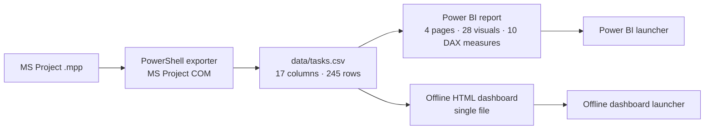

# 🏗️ Refinery EPC Progress Dashboard

**MS Project → weighted progress → Power BI + a zero-install offline dashboard**

[](https://github.com/hossein-moradi-sci/refinery-epc-progress-dashboard/actions/workflows/checks.yml)
[](LICENSE)
[](NOTICE.md)

<p align="center" dir="ltr">
  <a href="README.md"><strong>ENGLISH</strong></a>
  &nbsp;•&nbsp;
  <a href="README.fa.md"><strong>فارسی</strong></a>
</p>


## Overview

This project is an end-to-end progress-control dashboard built around an MS Project EPC schedule.

The source schedule is exported to a single CSV. That CSV is used by two independent front ends:
- a four-page Power BI report for reporting and project-control work;
- a single-file HTML dashboard that runs locally without Power BI, Node.js or an internet connection.

The main calculation is **weighted item-level progress**. It follows the weight-based roll-up used by the MS Project schedule instead of averaging task percentages. The published sample reproduces the MS Project roll-up within **0.15 percentage points**.

## ✨ Key features

- 📂 **Single source of truth** — both front ends use the same exported CSV.
- 📊 **Power BI report** — 4 pages, 28 visuals and 10 DAX measures, with Persian and English views.
- 🌐 **Offline dashboard** — one HTML file, with no Power BI or Node.js required at runtime.
- 🔽 **Drill-down and filtering** — phase, discipline and status filters, with comparison between two periods.
- 📅 **Look-ahead** — 7, 14 and 30-day views, plus critical-path and SPI information.
- 🖨️ **A4 meeting sheet** — a print-ready one-page project summary.
- 🔄 **Manual synchronisation** — data changes only when the user requests an update from MS Project.
- 🌍 **Bilingual interface** — Persian and English in both the report and offline dashboard.

> **Data note:** The published dataset is anonymised. The repository comes from a real refinery EPC progress-control workflow, but identifying project information has been removed or transformed. Names and dates are anonymised; weights and progress values are retained so the published calculations remain meaningful. The source .mpp, raw export and anonymisation vocabulary are not published. See [NOTICE.md](NOTICE.md).

## 📊 Sample dataset

| Metric | Value |
|---|---:|
| Schedule rows | **245** — 226 leaf items + 19 milestones |
| Weighted actual progress | **42.1%** |
| Weighted planned progress | **57.3%** |
| Variance | **−15.1 pp** |
| Schedule Performance Index (SPI) | **0.74** |
| Completed milestones | **8 / 19** |
| Critical items | **14** |
| Sample status date | **2025-06-30** |
| Agreement with MS Project roll-up | **within 0.15 pp** |

SPI is used here as a **schedule-only indicator** (actual / planned). The published export contains no cost data, so this project does not claim CPI or cost-based earned-value metrics.

## Why weighted progress?

A simple average gives every task the same influence. That is not appropriate for an EPC schedule where task weights can differ substantially.

**Weighted progress = Σ(WeightPercent × ProgressPercent) / Σ WeightPercent**

Only leaf items are included in the weighted progress calculation. The same logic is implemented independently in the Power BI model, the offline page and the verification tools.

## 🖼️ Screenshots

| Offline dashboard — light theme | A4 meeting sheet |
|---|---|
|  |  |

| Power BI — overview | Power BI — item details |
|---|---|
|  |  |

| Power BI — English overview | Power BI — English item details |
|---|---|
|  |  |

Full-page capture:


## 🧩 Architecture



The design rule is simple: **one exported CSV, two presentation layers**.

If the CSV structure changes, the exporter, Power BI model and web page are updated together. The rule is documented in [docs/architecture.md](docs/architecture.md).

## 🧮 Calculation model

| Measure | Formula |
|---|---|
| Weighted actual | Σ (WeightPercent × PhysicalPercentComplete) / Σ WeightPercent |
| Weighted planned | Σ (WeightPercent × PlannedPercent) / Σ WeightPercent |
| Variance | actual − planned |
| SPI | actual / planned |

Milestones are tracked separately from the leaf-item weighted progress.

The verification script independently recalculates the published CSV and checks the expected headline values.

## 🚀 Quick start

### Offline dashboard

1. Double-click **Launch Offline Dashboard.exe**.
2. It starts a local server on 127.0.0.1:8642 and opens the dashboard in the default browser.

The page provides Persian/English language switching, 7 visual themes, filters, drill-down, period comparison, 7/14/30-day look-ahead, an item table, an A4 meeting sheet and a manual **Update from MS Project** action.

It does not require Power BI, Node.js or an internet connection at runtime.

### Power BI report

1. Double-click **Launch Power BI Report.exe**.
2. The launcher adjusts the model data path to the current folder.
3. If an .mpp is available, the launcher can synchronise the CSV.
4. Open or refresh the Power BI report.

Synchronisation is intentionally manual. There is no scheduled task, background service or automatic 15-minute refresh.

## 🛠️ Engineering decisions

### MS Project COM

The exporter handles practical problems with MS Project COM, including stale instances, delayed startup and permission mismatches. It retries activation, prefers a usable running instance and can fall back to opening the file from disk.

CSV output is written through a temporary file before it replaces the previous export, preventing readers from seeing a partially written file.

### Power BI project files

The Power BI project is stored as PBIP/PBIR/TMDL rather than as one opaque report file. This makes the model and report definitions reviewable in Git, while also making naming and schema details important. The repository includes validation scripts for these files.

### Portable execution

Power Query uses an absolute data-folder parameter. **Launch Power BI Report.exe** rewrites that parameter to the current folder before opening the report, allowing the project to be carried on a USB drive without a machine-specific path.

### Offline front end

The HTML dashboard is self-contained and uses the same CSV as Power BI. The verification tools provide an independent calculation path for the headline progress numbers.

### Printing

The A4 meeting sheet is generated separately from the screen layout so the printed version remains readable and does not depend on the selected theme.

More technical decisions are documented in [docs/technical-decisions.md](docs/technical-decisions.md).

## ✅ Verification

The repository includes checks for progress calculations, project/model files, page syntax and anonymisation.

```bash
node tools/verify-progress.mjs --expect "42.1,57.3,-15.1" --leaves 226 --milestones 19 --critical 14
node tools/validate-json.mjs
node tools/check-page.mjs
```

The first command independently recalculates the headline metrics from the published CSV.

## ⚠️ Scope and limitations

- **Single-user:** no shared server, database or multi-user state.
- **No cost data:** CPI, cost curves and estimate-at-completion are outside the current model.
- **Not real-time:** synchronisation is manual.
- **Windows-first:** the exporter and launchers depend on Windows/MS Project tooling. The HTML page itself is standard HTML/JavaScript.
- **Not a Power BI replacement:** the offline page is a lightweight operational view; the full reporting model remains in Power BI.

## 🧑‍💻 My role

I built and delivered the system end to end for a refinery maintenance/project-control workflow.

My work covered both the project-control logic and the implementation:
- defining the weighted progress calculation;
- reproducing the MS Project roll-up within 0.15 percentage points;
- developing the MS Project export pipeline with PowerShell;
- building the Power BI model, report and DAX measures;
- developing the offline HTML dashboard;
- building the Windows launchers;
- adding validation and consistency checks;
- preparing the anonymised dataset and documentation.

The project sits at the intersection of **electrical power engineering, project planning and control, data analysis, Power BI and software development**.

## 📄 Licence and data

Code: [MIT](LICENSE).

The published dataset is derived from a real project but is anonymised and intended for demonstration only. Read [NOTICE.md](NOTICE.md) before reusing it.

**Eng. Hossein Moradi** — Electrical Power Engineer · Planning & Project Control

---

🌐 Persian version: **[README.fa.md](README.fa.md)**