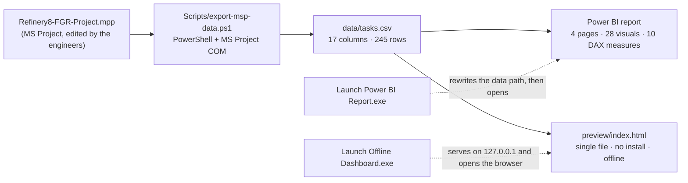

# Construction Progress Dashboard — Refinery EPC

**MS Project → weighted itemised progress → Power BI + a zero-install offline web dashboard**

[](https://github.com/hossein-moradi-sci/refinery-epc-progress-dashboard/actions/workflows/checks.yml)
[](LICENSE)
[](NOTICE.md)


A project-controls toolkit for a refinery EPC package: it reads the schedule straight out of
MS Project, converts it into a small CSV, and drives **two independent front ends** from that
one file — a four-page Power BI report and a single-file HTML dashboard that runs with no
install at all. The numbers it shows are the *weighted itemised* progress figures the
construction industry actually uses, validated against MS Project's own roll-up.

> **Data notice — the shipped dataset is anonymised.**
> This repository was extracted from a real construction project. Every task name, discipline,
> milestone, project title and date in `data/` has been replaced by a generated equivalent with
> `tools/anonymize-data.mjs`; the shipped calendar is shifted and the head-line percentages are
> the project's own. The original `.mpp` and the real export are **not** published, and neither
> is the vocabulary used to anonymise them. See [NOTICE.md](NOTICE.md) for exactly what was
> changed and what deliberately stayed.

## Head-line numbers

| | |
|---|---|
| Schedule items exported | **245 rows** — 226 leaf items + 19 milestones |
| Weighted actual progress | **42.1 %** (`Σ weight × Physical % Complete / Σ weight`) |
| Weighted planned progress | **57.3 %** |
| Variance | **−15.1 pp** (schedule behind plan) |
| Schedule Performance Index | **0.74** (`actual / planned` — schedule only, the export carries no cost data) |
| Milestones complete | **8 / 19** |
| Critical items | **14** |
| Status date (sample data) | 2025-06-30 |
| Agreement with MS Project's own roll-up | within **0.15 pp** on every task level |

## Why it exists

A construction package's progress is not an average of task percentages — it is a **weighted**
roll-up: a 0.2 %-weight instrument cable matters as little as a 6 %-weight compressor matters a
lot. MS Project computes that internally with its own formula columns, which means every
downstream view is one hand-edited cell away from disagreeing with the schedule that the client
signs off. The goal here was to make the *same* number appear in three places:

1. in MS Project, where the engineers edit `Physical % Complete`;
2. in Power BI, for the report pack and the meeting;
3. on a page that opens from a USB stick on a machine with nothing installed.

## Screenshots

| Offline dashboard (light theme) | The A4 meeting sheet it prints |
|---|---|
|  |  |

| Power BI — overview (FA) | Power BI — item details (FA) |
|---|---|
|  |  |

Full-page capture: [`docs/img/dashboard-full.png`](docs/img/dashboard-full.png) ·
English report pages: [`pbi-page3`](docs/img/pbi-page3-dashboard-en.png) / [`pbi-page4`](docs/img/pbi-page4-details-en.png)

## Architecture



One file changes → both views change. Renaming a CSV column means touching the exporter, the
TMDL tables and the page in the same commit; that constraint is written down in
[docs/architecture.md](docs/architecture.md).

## The maths

| Measure | Formula |
|---|---|
| Weighted actual | `Σ (WeightPercent × PhysicalPercentComplete) / Σ WeightPercent` over **leaf items only** |
| Weighted planned | `Σ (WeightPercent × PlannedPercent) / Σ WeightPercent` over leaf items |
| Variance | `actual − planned` |
| SPI | `actual / planned` — schedule index; deliberately **not** CPI, because the export has no cost data |

The model does this in DAX from `ActualWeight` / `PlannedWeight`; the page and
`tools/verify-progress.mjs` recompute it from `WeightPercent` × the percentages. Both paths are
checked against each other — see below.

## Repository layout

```
.
├─ Launch Offline Dashboard.exe     one-click offline page (Windows, no install)
├─ Launch Power BI Report.exe       fixes the data path, syncs, opens the report
├─ Project-File/                    drop folder for the engineers' .mpp  (see its README)
├─ Refinery8-FGR-Dashboard/         the dashboard itself
│   ├─ Refinery8-FGR.pbip           Power BI project (report + semantic model)
│   ├─ Refinery8-FGR.Report/        4 pages, 28 visuals, FA + EN, custom theme
│   ├─ Refinery8-FGR.SemanticModel/ hand-written TMDL: 3 tables, 10 measures
│   ├─ data/                        the synced CSVs (the anonymised sample ships here)
│   ├─ preview/index.html           the offline dashboard — one file, 4,090 lines
│   ├─ preview/server.mjs           the same static server in Node (dev/agent use)
│   ├─ Scripts/                     exporter (PowerShell), launchers (C#), build script
│   └─ README.md                    the original Persian operations manual
├─ tools/                           anonymise · verify · leak-check · validate · check-page
├─ .github/workflows/checks.yml     the gates that run on every push
└─ docs/                            architecture, decisions, portfolio text, screenshots
```

## Quick start

**Nothing installed — the offline dashboard**

```
1. Double-click  Launch Offline Dashboard.exe
2. It serves the page on http://127.0.0.1:8642 and opens your browser.
```

The page is Persian by default with an EN switch, seven colour themes, slicers, drill-down
(global and per-chart), a chart picker, period comparison, look-ahead, a virtualised item table
and an A4 meeting sheet on `P` / `Ctrl+P`. It works with **no** Power BI, **no** Node, **no**
internet. Nothing in it runs on a timer: the numbers change only when you press
**«به‌روزرسانی از MS Project»**, which runs the exporter hidden and reloads.

**Power BI report**

```
1. Double-click  Launch Power BI Report.exe
   (it rewrites the model's absolute data path to this folder, syncs if a .mpp is present,
    then opens Refinery8-FGR.pbip)
2. No .mpp yet? The report still opens on the CSV that ships in data/.
```

**Refreshing from a real schedule**

```
1. Put the engineers' .mpp into Project-File\  (newest file wins, name does not matter)
2. PowerShell -File Refinery8-FGR-Dashboard\Scripts\export-msp-data.ps1     (needs MS Project)
3. Offline page: press the update button.  Power BI: press Refresh.
```

The workflow is **manual by design**: no Windows task, service or watcher exists anywhere in
this project, because a construction team that sees a window appear by itself stops trusting the
numbers. The cadence is the file motion between engineers, not a timer.

## What was actually hard

The domain maths is a weighted mean; the engineering was everything around it.

- **MS Project COM is a hostile API.** `GetActiveObject` can hand back a zombie whose `Projects`
  collection is empty after a force-killed instance; `CreateInstance` throws a transient
  `InvalidCastException` while a previous process is still deregistering. The exporter therefore
  retries activation, prefers a *live* instance, reuses a running MS Project instead of spawning
  a second one, and falls back to opening the file from disk head-lessly, writing the CSV
  atomically (`.tmp` → move) so Power BI can never read a half-written file.
- **The Power BI project is hand-written.** The `.pbip` is TMDL + PBIR JSON, and the failure mode
  of a mistake is a dialog that says only *"Issues were found"* — the actual message renders in a
  WebView that neither Win32 nor UI Automation can read. `//` comments are invalid (only `///`),
  hand-made `lineageTag`s break the model, and a theme that is one colour slot short is silently
  ignored rather than reported.
- **Portability is one absolute path.** Power Query has no relative-path option, so the model's
  `DataFolder` parameter is absolute and any move of the folder breaks every table. The Power BI
  launcher rewrites that value on each launch; it is the single line that makes the USB-stick
  copy work.
- **The launchers are C# 5 by constraint.** They are compiled with the .NET Framework's
  `csc.exe` (no SDK, no NuGet): one serves the folder on loopback and shuts itself down three
  minutes after the last page heartbeat, the other finds a non-standard Power BI install, fixes
  the data path and presses Power BI's *"Refresh now"* banner through UI Automation.
- **The report has to survive a printing.** The meeting sheet is built off-screen, measured and
  filled row by row until one A4 page would overflow, then printed with the light "paper" palette
  even when the dashboard is dark — which is why the sheet re-renders its own S-curve instead of
  cloning the dark one.

More of this, including the mistakes that produced the rules, is in
[docs/technical-decisions.md](docs/technical-decisions.md).

## How it is verified

Nothing here is taken on trust — every claim above has a command behind it, and the three that
need no private input run in CI on each push (`.github/workflows/checks.yml`, the badge at the
top of this file is that job):

| Gate | Command | What it proves | CI |
|---|---|---|---|
| Progress maths | `node tools/verify-progress.mjs --expect "42.1,57.3,-15.1" --leaves 226 --milestones 19 --critical 14` | the CSV still rolls up to the numbers the dashboard claims, and Power BI's weight columns agree with the page's arithmetic | ✅ |
| Report/model integrity | `node tools/validate-json.mjs` | every `.json`/`.pbip`/`.platform` parses, the custom theme is wired and shaped the way Power BI actually applies it, and the project paths resolve | ✅ |
| Page syntax | `node tools/check-page.mjs` | the page has exactly one `<script>` block and it parses as JavaScript | ✅ |
| Anonymisation | `node tools/leak-check.mjs` | none of the source project's vocabulary survives anywhere in the tree — binaries included | author-side |
| Launchers | `powershell -File Refinery8-FGR-Dashboard\Scripts\build-launchers.ps1 -OutDir .` | the `.cs` sources still compile with the framework's `csc.exe`, no SDK needed | Windows |

```bash
# thirty seconds, from a fresh clone, no install:
node tools/verify-progress.mjs --expect "42.1,57.3,-15.1" --leaves 226 --milestones 19 --critical 14
node tools/validate-json.mjs
node tools/check-page.mjs
```

The leak scan of course carries the vocabulary of the project it is protecting, so it is the one
gate that stays on the machine that owns the data: `tools/README.md` explains the split, and
`NOTICE.md` documents what the anonymisation did and the one leftover it consciously accepts.

## Limitations, honestly

- **Single user, single machine.** No server, no database, no multi-user state. Two people editing
  the same copy of the *dashboard* would collide — that is what the `.mpp` hand-off is for.
- **No cost data** in the export, so there is deliberately no CPI, no earned-value cost curve, and
  no forecast to complete. Adding them means extending the exporter first.
- **Manual refresh by design** (above), so "the number is stale" is a workflow property, not a bug.
- **Windows-first.** The launchers and the exporter use MS Project COM and WinForms; the *page*
  itself is plain HTML/JS and would run anywhere it is served from.
- **CI covers three of the five gates.** The leak scan and the launcher build cannot run on a
  public runner: the first needs the private vocabulary, the second needs Windows and the .NET
  Framework. Both are one command for the author and documented in `tools/README.md`.
- **The offline page is not a Power BI replacement.** It reproduces the itemised maths, the
  S-curve and the slicers; the report is where the client-facing pages live.

## How this was built

I am an electrical power engineer, not a software engineer: I specified this tool, own its domain
logic (the weighted roll-up, the look-ahead window, what SPI does and does not mean), validated
every number against MS Project, and tested it on Windows across the USB-stick, Power BI and
offline paths. The code itself was written in **AI-assisted** sessions under my direction — which
is why the repository carries the unusual amount of written-down reasoning in `docs/`, and why
`tools/` exists at all: the verification had to be something I could run and read myself.

If you are reading this as a reviewer: the interesting parts to ask about are the weighted
roll-up, why the S-curve is pinned at both ends, why the donut filters instead of drills, and why
the sync is manual.

## Licence and data

Code: [MIT](LICENSE). The sample dataset is derived from a real project and is published for
demonstration only — see [NOTICE.md](NOTICE.md) before reusing it.

**Eng. Hossein Moradi** — power/electrical technology engineer, construction project controls.

---

# داشبورد پیشرفت پروژهٔ EPC — پالایشگاه

**MS Project ← پیشرفت آیتمیک وزنی ← Power BI و یک داشبورد وب آفلاین بدون نیاز به نصب**

> **یادداشت داده — دیتاست منتشرشده بی‌نام‌شده است.**
> این مخزن از یک پروژهٔ عمرانی واقعی استخراج شده است. نام تمام آیتم‌ها، دیسیپلین‌ها، نقاط
> عطف، عنوان پروژه و تاریخ‌ها در `data/` با ابزار `tools/anonymize-data.mjs` جانشین شده‌اند؛
> تقویم جابه‌جا شده و درصدهای سرانه، همان اعداد واقعی پروژه‌اند. فایل `.mpp` و خروجی واقعی
> منتشر نشده‌اند و واژگان مورد استفاده برای بی‌نام‌سازی هم منتشر نشده است. جزئیات دقیق در
> [NOTICE.md](NOTICE.md).

## اعداد کلیدی

| | |
|---|---|
| اقلام خروجی | **۲۴۵ ردیف** — ۲۲۶ آیتم برگ + ۱۹ نقطهٔ عطف |
| پیشرفت واقعی وزنی | **۴۲٬۱٪** — `Σ (وزن × Physical % Complete) ÷ Σ وزن` |
| پیشرفت برنامه‌ای وزنی | **۵۷٬۳٪** |
| انحراف | **−۱۵٬۱ واحد درصد** (عقب‌تر از برنامه) |
| SPI | **۰٫۷۴** (نسبت واقعی به برنامه‌ای؛ فقط زمان‌بندی — دادهٔ هزینه در خروجی نیست) |
| نقاط عطف تکمیل‌شده | **۸ از ۱۹** |
| اقلام بحرانی | **۱۴** |
| تاریخ وضعیت (دادهٔ نمونه) | ۲۰۲۵-۰۶-۳۰ |
| تطابق با رول‌آپ خود MS Project | کمتر از **۰٬۱۵ واحد درصد** |

## چرا ساخته شد

پیشرفت یک پکیج عمرانی میانگین درصد کارها نیست؛ یک **میانگین وزنی** است. MS Project این عدد را
با فرمول‌های داخلی خودش می‌سازد و همین باعث می‌شود هر نمایش دیگری با فایلی که به کارفرما
تحویل داده می‌شود اختلاف پیدا کند. هدف این پروژه این بود که **همان یک عدد** در سه جا دیده شود:
در MS Project که مهندس‌ها ویرایش می‌کنند، در گزارش Power BI برای جلسه، و در صفحه‌ای که از روی
فلش روی سیستمی که هیچ‌چیز نصب ندارد باز می‌شود.

## شروع سریع

- **بدون نصب — صفحهٔ آفلاین:** `Launch Offline Dashboard.exe` را دوبار کلیک کنید. صفحه روی
  `http://127.0.0.1:8642` سرو و در مرورگر باز می‌شود. بدون Power BI، بدون Node، بدون اینترنت.
  هیچ چیزی روی تایمر اجرا نمی‌شود؛ عددها فقط با دکمهٔ «به‌روزرسانی از MS Project» عوض می‌شوند.
- **گزارش Power BI:** `Launch Power BI Report.exe` را اجرا کنید. مسیر داده را با پوشهٔ فعلی
  هماهنگ می‌کند، اگر فایل `.mpp` موجود باشد سینک می‌کند و بعد گزارش را باز می‌کند.
- **سینک از فایل واقعی:** فایل `.mpp` را در `Project-File\` بگذارید (جدیدترین فایل خوانده
  می‌شود، نام مهم نیست) و `Scripts/export-msp-data.ps1` را اجرا کنید (نیازمند MS Project).

## ساختار

هر تغییر در یک فایل، هم‌زمان روی هر دو نمایش اثر می‌گذارد: خروجی CSV هستهٔ مشترک Power BI و
صفحهٔ وب است. ساختار پوشه‌ها، فرمول‌ها و قیدهای تغییر در
[docs/architecture.md](docs/architecture.md) و چرایی تصمیم‌های فنی در
[docs/technical-decisions.md](docs/technical-decisions.md) آمده است (هر دو انگلیسی).

## اعتبارسنجی

- `node tools/verify-progress.mjs --expect "42.1,57.3,-15.1"` — بازمحاسبهٔ مستقل سرانه‌ها از CSV.
- `node tools/leak-check.mjs` — اثبات اینکه هیچ واژه‌ای از پروژهٔ اصلی (حتی داخل فایل‌های
  اجرایی) در درخت منتشرشده باقی نمانده است.

## محدودیت‌ها

تک‌کاربره و تک‌سیستمی؛ بدون دادهٔ هزینه (پس CPI وجود ندارد)؛ به‌روزرسانی دستی *به‌عمد*؛
اجراکننده‌ها و اسکریپت سینک ویندوزی‌اند (خود صفحه وب است و هرجا سرو شود کار می‌کند)؛ و
هیچ CI‌ای راه‌اندازی نشده است.

## این پروژه چگونه ساخته شد

من مهندس برق قدرت هستم، نه مهندس نرم‌افزار: نیازمندی‌ها را من تعیین کردم، منطق دامنه‌ای
(میانگین وزنی، پنجرهٔ پیش‌نگر، معنای SPI و آنچه نیست) متعلق به من است، همهٔ اعداد را با
MS Project صحه‌گذاری کردم و مسیرهای فلش/Power BI/صفحهٔ آفلاین را روی ویندوز تست کردم. کد با
رهیافت **AI-assisted** و زیر نظر من نوشته شده است — و به همین دلیل است که مستندات این مخزن
بی‌معمول مفصل‌اند و پوشهٔ `tools/` وجود دارد: اعتبارسنجی باید چیزی می‌بود که خودم بتوانم
اجرا و بازخوانی کنم.

## پروانه و داده

کد با پروانهٔ [MIT](LICENSE). دادهٔ نمونه از یک پروژهٔ واقعی مشتق شده و فقط برای نمایش منتشر
شده است — پیش از استفادهٔ مجدد [NOTICE.md](NOTICE.md) را ببینید.

**مهندس حسین مرادی** — مهندس تکنولوژی برق قدرت، کنترل پروژه‌های عمرانی.
