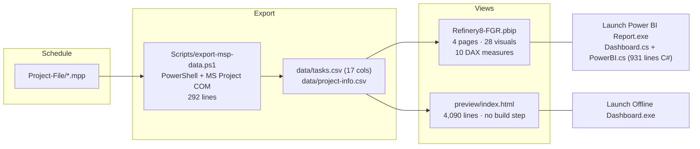

# Architecture

## One line

An MS Project file becomes a small CSV, and that CSV is the single source of truth for two
independent front ends: a Power BI report and a single-file offline web page.



## Components

| Component | File | Responsibility |
|---|---|---|
| Exporter | `Refinery8-FGR-Dashboard/Scripts/export-msp-data.ps1` | find the newest `.mpp`, read the schedule through MS Project COM, project it to 17 columns, write the CSV atomically |
| Manual trigger | `Scripts/Sync-Now.vbs` | run the exporter with no console window (the desktop-shortcut path) |
| Semantic model | `Refinery8-FGR.SemanticModel/definition/*` | hand-written TMDL: 3 tables, 10 measures, one `DataFolder` parameter |
| Report | `Refinery8-FGR.Report/definition/*` | PBIR: 4 pages (FA + EN), 28 visuals, custom theme `RefineryTheme.json` |
| Offline page | `Refinery8-FGR-Dashboard/preview/index.html` | the entire dashboard: KPIs, 5 charts, slicers, drill, print sheet, 7 themes, FA/EN |
| Dev server | `Refinery8-FGR-Dashboard/preview/server.mjs` | the same static server in Node, for agent-side/browser testing |
| Offline launcher | `Scripts/Dashboard.cs` + `LauncherCommon.cs` | loopback HTTP server on 127.0.0.1:8642, opens the browser, `/api/sync` runs the exporter, idle shutdown after ~3 min without a heartbeat |
| Power BI launcher | `Scripts/PowerBI.cs` + `LauncherCommon.cs` | rewrite the model's absolute data path, sync, find Power BI anywhere (registry / Store / drive scan), open the report, press the *Refresh now* banner |
| Launcher build | `Scripts/build-launchers.ps1` | compile both launchers with the .NET Framework `csc.exe` — no SDK, C# 5 only |
| Optional add-in | `Scripts/Register-CustomPart.ps1` | register a Power BI *External Tools* button (needs admin; not installed here) |
| Verification | `tools/*.mjs` | recompute the maths, scan for leaks, validate the project JSON, check the page script |

## The contract: files that change together

| Change | Files that must change in the same commit |
|---|---|
| A renamed CSV column | `Scripts/export-msp-data.ps1` **and** the TMDL table that reads it **and** `preview/index.html` |
| A new model-side label that a user reads | the Power Query column (FA) and its `… EN` twin, plus the English pages — the report binds Persian labels to the FA pages and the `EN` columns to the English ones |
| A report visual or page | ideally `Refinery8-FGR.Report/definition/…`, then `tools/validate-json.mjs` before opening Power BI |
| A launcher change | `Scripts/*.cs`, then `build-launchers.ps1`, then re-run the offline launcher once (the old `.exe` holds a file lock) |
| Anything at all | the portable copy the engineers carry on a USB stick, which mirrors the code + docs set |

## Data model

`tasks.csv` (one row per task) is projected by the exporter to exactly these columns:

```
UniqueID  TaskName  WBS  Phase  Disciplines  IsSummary  IsMilestone
WeightPercent  PlannedWeight  ActualWeight  Start  Finish
PhysicalPercentComplete  PlannedPercent  ActualPercent  Critical  StatusDate
```

- `WeightPercent` is MS Project's `Number1` — the **Weight Factor** (`(%W.F)` in the UI).
- `PlannedWeight` / `ActualWeight` are `weight × planned %` and `weight × actual %`; Power BI
  divides the sums, the page multiplies the same way, and `tools/verify-progress.mjs` checks the
  identity `ActualWeight = WeightPercent × PhysicalPercentComplete` holds (it does, exactly).
- `IsSummary` is `False` for every exported row in this 16-column projection: summary rows are
  rolled up in the views, not exported. The two **leaf** counts therefore come from
  `IsSummary=False AND IsMilestone=False` (226) while milestones are counted separately (19).
- Booleans are the **strings** `True`/`False` (capitalised, quoted). A `=== 'false'` filter
  silently matches nothing.
- Percentages are 0–1 fractions, not 0–100.

`project-info.csv` carries one row: `RefreshedAt`, the moment of the last export.

The three model tables: `MSP_Tasks` (the rows + all measures), `MSP_ProjectInfo` (the refresh
timestamp), `Milestones` (the milestone subset with its Persian/English progress categories).

## Portability

The only machine-bound value in the whole tree is the model's `DataFolder` parameter, because
Power Query has no relative-path option:

```
expression DataFolder = "C:\path\to\dashboard\data" meta [IsParameterQuery = true, …]
```

`Launch Power BI Report.exe` rewrites that line to the folder the launcher is running from, on
every launch, before it opens the report — which is what makes a copy on a USB stick open
correctly on another machine. When opening the `.pbip` **directly** (without the launcher), edit
that one line first. Nothing else in the tree uses an absolute path; the exporter derives every
path from `$PSScriptRoot`, and the launchers derive everything from their own location.

## Runtime shape of the offline page

```
Launch Offline Dashboard.exe
  ├─ serves <dashboard>/ (loopback only, port 8642 or the next free one)
  ├─ opens the default browser
  ├─ GET  /                     -> preview/index.html
  ├─ GET  /data/tasks.csv       -> the CSV the Power BI model also reads
  ├─ GET  /api/health|ping      -> liveness; the page pings on load, on tab focus,
  │                               and at most once a minute
  ├─ POST /api/sync             -> runs export-msp-data.ps1 hidden, returns {ok,message,tail,at}
  └─ exits ~3 minutes after the last ping (the Update button and F5 stay alive meanwhile)
```

The page does no other background work: no polling, no timer that re-reads the CSVs, no OS task,
no service, no watcher anywhere in the project. Data changes only when the user presses the
update button.
